# Phase 1 · Checkpoint D1: Tell → Understand → Review → Memory

**Status: approved by the founder subject to two trust checks (§0); both now pass.** Merged (`8415943`), migrated and deployed with verified parity. Internal enablement is ready and waits on named accounts and a build (§8). Today, reasons, Garden, Intentions, Landscape, the Opportunity Engine and broader product intelligence have not started.

| | |
|---|---|
| Branch | `claude/gifted-pasteur-e2q0qu`, after PR #13 merged (`956c3d9`) |
| D1 commits | `15cd5cf` (resolve action), `af3828e` (client core), `ff4691b` (2.0 shell and screens), `3628057` (Undo restores what a memory replaced), `5c700e9` (record and screenshots), and the trust-check commit carrying §0 |
| New migrations | `20261004130000_v2_resolve_capture_review`, `20261004140000_v2_restore_superseded` (forward-only; applied to production only by a merge to `main`) |
| Paid model runs | none in D1. The extraction pipeline, prompt v5, guards, date resolver, person resolution, schema and model configuration are unchanged |

## 0. Founder review: two pre-dogfood trust checks (4 Oct 2026)

D1 was approved subject to two trust checks. Both are now resolved; the earlier sections are updated to match.

### Check 1: confirmation semantics

**Invariant:** if Kinship asks for confirmation because a wrong interpretation could materially damage trust, the proposed interpretation is not memory until the user accepts it.

**Before:** every "light" item was written to `memory_items` (`unreviewed`) when the review appeared, sensitive ones included.

**Now** (`supabase/functions/_shared/extraction/acceptance.ts`, shared by the gateway and the app):

| Class | Reasons | Behaviour |
|---|---|---|
| **A: trust-required (blocking)** | any `sensitivity ≠ none` (health, death/grief, conflict, money, other private: illness, pregnancy, miscarriage, divorce, addiction/rehab, legal trouble, financial distress, private identity), which carries `sensitive` / `sensitivity_raised`; `date_ambiguous` (the day reads two ways) | **Pending, not memory.** Held in `capture_reviews` with the note's other held items, so it survives restart and sync. It is not a `memory_items` row: not on the person's record, not a merge or supersede target, not available to future reasons or ranking, and never shown as remembered. The sheet asks "Remember this about Sarah?" with the user's words, who and when: **Remember** (with "A different day" for an ambiguous day) or **Don't keep this**. Done, dismissal, idle, relaunch and the left-open timeout never accept it. Unanswered, it lapses with the review after 30 days and is never written. |
| **Already pending: clarification ("hold")** | `new_person`, `person_ambiguous`, `person_disagreement`, `pronoun_multiple`, `subject_check`, `date_unresolved_sensitive` | Unchanged: one question; answering it is the user's explicit choice and writes the item. Never answered on the user's behalf. |
| **B: conservative review (non-blocking)** | `mid_confidence` (< 0.85), `date_coarse`, `reported`, `certainty_lowered`, `pronoun` (one possible person), `new_related`, `protected_target`, `tradition` | Unchanged for now: saved on show as `unreviewed`, correctable, Done confirms. The friction decision waits for dogfood evidence. |

**What it took:**

- **Gateway** (`handler.ts`): blocking "look over" items go to the pending review instead of being saved; nothing else in the write path changed.
- **Resolve** (`resolve.ts`):
  - An item held only for a yes needs an explicit `accept: true`; an empty answer is refused.
  - `skip` writes nothing.
  - A yes can't move the item to another person.
  - For an ambiguous day, the user may pick the right day.
- **App:** the review model asks the "Remember this?" question, with analytics type `keep`.
- **Unchanged:** the extraction pipeline, prompt v5, guards, schema, model and every eval gate. The baseline replay still passes.

**Tests:**

- Deno: a sensitive reading is held, not saved; silence isn't a yes; only `accept` writes it; a yes can't move it; ambiguous-day handling.
- Jest: a dated health event isn't memory on show, on Done, after a relaunch or after an hour, and is written only on Remember; a turned-down divorce note is never remembered; review-model and sheet coverage of the new question.

### Check 2: user-visible grounding

**Finding:** case **A**, a hand-authored fixture, and the fixture itself was ungrounded. No UI code synthesizes wording:

- Statements render verbatim (`itemLine`, the summary and the Source view).
- Formatting adds only dates (`whenLabel`) and generic labels (`kindLabel`).
- `event_type`, `event_goal`, `place` and other structured fields are never turned into words.

"Ben runs the Chicago Marathon on Sunday" was written by hand into the D1 lab, the D1 tests and one Checkpoint B repository test. The canonical note never says "marathon", and eval `core-001` forbids it (`must_not: marathon|26.2|4:00|sub-4`). The lab also showed "hoping to break four hours" as a separate item, which `core-001` also forbids: the goal belongs on the race event. The lab's conflict example said "sub-4".

**Fixed:**

- Every fixture now uses the pipeline's grounded output: "Ben runs Chicago Sunday", one event, with goal "break four hours" kept in its detail.
- The lab conflict example now reads "Ben hopes to break four hours".
- The affected screenshots were regenerated.

**Regression** (`src/features/tell/__tests__/grounding.test.tsx`): the canonical Ben memory, written exactly as the gateway writes it, is rendered through the summary, Tell, the review sheet, the person record and the Source view. No visible text or accessibility label may match `marathon|26.2|4:00|sub-4|race`, and the statement must appear verbatim on every surface.

### Retention follow-up: plan, not built in D1

pg_cron is available in production but not installed. One forward-only migration, before external beta:

1. **`settle_unopened_reviews(p_after interval DEFAULT '14 days')`**, service role only. It settles captures that are `needs_review` with no `capture_reviews` row (only non-blocking class-B notes are left in that state) and `updated_at` older than `p_after`. It goes through `settle_capture_review`, so `status = extracted` and, for `delete_after_extraction`, `raw_text` is nulled while source quotes remain.
2. **Pending reviews** (questions and class-A readings) are never settled early. Only `purge_expired_capture_reviews` (30 days, as today) removes them, and it writes nothing. The note is settled as written, and "delete after" text goes then. A question is never answered for the user.
3. **Schedules** (pg_cron, staggered off the hour):
   - `purge_expired_capture_reviews()` daily;
   - `settle_unopened_reviews()` daily;
   - `purge_tombstones()` daily (30-day tombstones and Undo history).

   All three run as service-role functions that already exist (or ship in the same migration). Each is guarded by `IF EXISTS (pg_extension pg_cron)` so the local pgTAP build stays green.
4. **pgTAP:** settle ages correctly, never touches a capture with a pending review, purges "delete after" text and keeps quotes; the schedules exist in production after merge (checked with `cron.job` in the ops record).

**Status:** the plan is ready. It is not built, because D1 doesn't need it for a 2–5 person internal dogfood and you asked that D1 not grow.

### Native dogfood checklist (first pass, on a real iPhone)

| Area | Check |
|---|---|
| Fonts | DM Serif Display statements and DM Sans body render and are not substituted; nothing is clipped |
| Sheets | The review sheet opens, scrolls, and its picker panes switch without a stacked modal; the scrim dismisses; the keyboard doesn't cover Save |
| Keyboard | The Tell field grows, Keep stays reachable, and dismissing the keyboard keeps the draft |
| Dynamic Type | XS → AX3: statements wrap, Pills don't truncate, the calendar stays usable |
| VoiceOver | Tokens read "Who: Ben, double-tap to change"; × reads "Not this: …"; the sheet traps focus; the question and its choices are reachable in order |
| Light mode | Paper, ochre and ink as specified (the app is light-only) |
| Offline and relaunch | Tell in airplane mode and kill the app; relaunch online and the note is understood once; an answer given offline is sent on reconnect |
| Clarification | Two Sams, Sarah or her sister, someone new, an ambiguous day, and a sensitive "Remember this?" |
| Correction | Words, who, when and kind; "You edited this" appears; the change survives a relaunch |
| Undo | Undo on the summary and after Done; a replaced fact comes back |
| Source and provenance | "You told Kinship · …" opens the note with evidence marked; deleting a note forgets what came only from it |

Fix obvious usability and accessibility defects before adding more internal users.

## 1. What D1 is

A note goes from the user's words to remembered, reviewable, correctable memory, with its source:

```
Tell ── kept on the device at once (encrypted store, outbox) ─────────── "Kept"
  │ sync (when online)
  ▼
ai-gateway relationship_extract ── one model run per note, ever
  │   saved items (auto, light) written with their sources
  │   held items + one question stored in capture_reviews
  ▼
sync pulls the items ── the review on the Tell screen
  │   everything clear  → a short summary, Undo for 4 s
  │   something to look → "Here's what I'll remember": tokens, ×, Done
  │   a question        → one question, the user's own people as choices
  ▼
resolve_review (answer, no model call) or close_review (done)
  ▼
the person's record ── each line with "You told Kinship · Oct 8" → the note
```

### Architecture (client)

| Layer | File | Role |
|---|---|---|
| Gateway client | `src/store/gateway.ts` | Typed `understand` / `answer` / `close`. Requests carry ids only. "No answer" (`GatewayUnreachable`) is kept apart from a refusal (`GatewayRefused`, by the gateway's error code) |
| Understanding | `src/store/understanding.ts` | One persisted state machine per note in the encrypted store (`understanding` table): `waiting → review → answering / closing → done`, or `kept`. Every step is safe to repeat |
| Detail rules | `src/store/memoryDetail.ts` | Kind and date changes produce detail the database accepts (`memory_detail_ok`); never invents a date |
| Flags | `src/store/flags.ts`, `src/hooks/useFlags.ts` | Per-account flags from `my_flags()`, kept on the device for the next launch, off when unknown (FLG-02); `shell_v2` chooses the shell at launch (FLG-04) |
| Session | `src/providers/V2SessionProvider.tsx` | The signed-in user's store, sync and Understanding; runs at start, on foreground and every 30 s |
| Review model | `src/features/tell/reviewModel.ts` | Pure: the review as human copy, questions mapped to typed answers |
| Screens | `app/v2/*` over `src/features/*` views and `src/ui/*` | Tell + review sheet, People, a person's record, the Source view |

Layering holds: screens use hooks, hooks use repositories and Understanding; screens never import Supabase or store internals (ESLint, `layering.test.ts`).

## 2. Tier semantics (D1.1)

Inspected in code and the database; unchanged by D1.

| Item tier (pipeline `tierFor`) | When | What happens |
|---|---|---|
| hold | any of `new_person`, `person_ambiguous`, `person_disagreement`, `pronoun_multiple`, `subject_check`, `date_unresolved_sensitive` (or no person) | not memory: stored in `capture_reviews` (30 days) with the question; written only after the user answers |
| confirm ("light") | any other flag: `sensitive`, `sensitivity_raised`, `reported`, `certainty_lowered`, `date_ambiguous`, `date_coarse`, `protected_target`, `mid_confidence` (< 0.85), `tradition`, `pronoun`, `new_related` | **after the founder review (§0):** sensitive or `date_ambiguous` → pending until "Remember"; the rest saved on show, `unreviewed`, with the sheet open until Done or 20 s idle |
| auto | no flag | saved `unreviewed`; a summary for 4 s with Undo |
| dropped | confidence < 0.60 (< 0.30 when the doubt is only *who*), or a failed guard | not written; the note keeps the words |

The note is `clarify` if anything is held, else `confirm` if anything is light, else `auto` (or `nothing`). The capture becomes `needs_review` when something is held or the note is light; otherwise `extracted`.

Sensitive items are never auto (they always carry `sensitive`). A health or death event without a resolvable date is held. Both match plan §8.

**Gaps found and closed in D1:**

- Held items lacked their confidence and proposed action, so an answer couldn't be written the way an extraction is. They are now stored with the review.
- The client had no way to name which review it answered. Replies now carry the review's `created_at`.
- There was no way to answer at all. The resolve action now does it (§3).
- Undo and "Not this" on an item that had replaced an older one lost both items. The older one is now restored (§6).

## 3. The resolve action (C-2)

`POST ai-gateway {action: "resolve_review", input_ref: {capture_id}, review_created_at, answers: [...]}`: one answer per held item, by index (a person, "someone new", Sarah or her sister, a day or "no date", or skip).

1. Signed-in owner, AI consent and the `ai_extraction` flag (the answer turns an AI reading into memory). Close needs only the owner.
2. Deterministic revalidation, no model call (`_shared/extraction/resolve.ts`): the person must be the user's own and not archived; "someone new" only with the name the note gave; a relation only if it is the user's own word in the note; a date must be a real calendar day; a proposal that no longer fits is redone as new; an exact duplicate merges.
3. One transaction (`resolve_capture_review`, service role only): the capture is live, the user's and still waiting; the review is the one answered; every quoted span still reads the same; new people are created from the note's own name; items are written through `write_extraction` (same ownership and protected-target checks); the review is deleted and the capture settled (with `delete_after_extraction`, the note's text goes and the quotes stay).
4. Idempotent: a retry after a lost reply returns `already_resolved` and writes nothing.

Refusals: a changed review or note returns `409 review_changed`; a capture no longer waiting returns `409 not_waiting`; a person removed meanwhile returns `409 invalid_answer`; a deleted capture returns `404`; a malformed answer returns `400 invalid_answer` with a fixed reason code.

## 4. The review UI (D1.4, D1.5)

| State | What the user sees |
|---|---|
| Kept, understanding | "Understanding…" under the field |
| Offline | "I'll understand this when you're online." The note is safe on the device |
| Everything clear | "Kept: Ben runs the Chicago Marathon on Sunday · Sun, Oct 11" with Undo, for 4 s. Tapping it opens the sheet |
| Something to look over | "Kept for Ben". Each item is a serif statement with tokens for who, when and what kind; × for "Not this"; Undo, See the note, Done |
| A sensitive or ambiguous-day reading | Not remembered yet: "Remember this about Sarah?" with the user's words, who and when; Remember (or A different day) / Don't keep this |
| A question | One at a time: "Which Sam do you mean?" with the user's Sams told apart ("Sam (neighbor)", "Sam (climbing)"), "Someone else", "Don't keep this". Also "Is this about Sarah, or Sarah's sister?", "Is Maya someone new?" and "When is it?" (Pick a date / No date) |
| Answer on its way | "Saving your answer…" or "I'll save your answer when you're online." |
| Changed elsewhere | "This changed on another device." |
| Not understood | "Kept as you wrote it." |
| Later | Quiet lines on the Tell screen: "A question about one of your notes · Answer", "I understood 2 notes · Review". Never a push, badge or count to clear |

Corrections from the sheet or a person's record:

- **Words:** edit the statement.
- **Who:** the user's people, searchable.
- **When:** a calendar or "No date".
- **What kind:** something true, something happening, a plan, something ongoing, a moment, a milestone.

Every change is the user's: `user_state = edited` plus a `user_edit` source.

The screens never show numeric confidence, tier names, the model, guard flags or database terms. A test scans every string the review produces (`reviewModel.test.ts`), and another scans what the sheet renders (`ReviewSheet.test.tsx`).

Quiet Herbarium: paper, ochre and serif statements. There is no Card, score, streak, health meter, urgency or guilt copy. The people list is names only. Tokens are provisional (`src/design/tokens.ts`): the plan's Newsreader and Instrument Sans aren't installed yet, so the bundled DM Serif Display and DM Sans stand in; night is defined but the app is still light-only. Text pairs are tested at ≥ 4.5:1. **Finding:** ochre on paper (`#8A6417` on `#EFEEE9`) is 4.62:1, which passes AA but is not the 5.1:1 the design canvas lists.

### Screenshots

Real components and copy, rendered from fixtures by the dev-only lab (`app/lab.tsx` → `src/dev/v2Lab.tsx`, off unless `EXPO_PUBLIC_V2_LAB=1`). They were captured with react-native-web in Chromium at an iPhone 15 width. These are not device captures; native rendering is checked during dogfood.

| | |
|---|---|
| 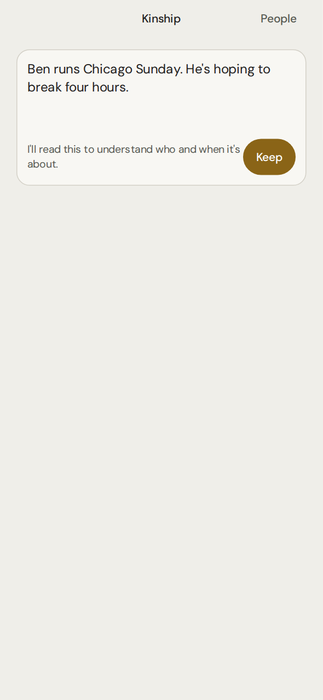 Tell | 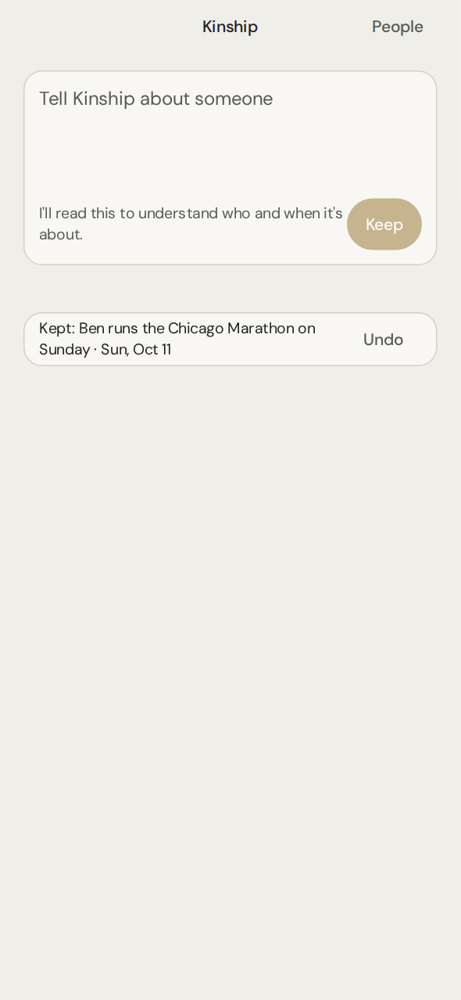 Everything clear: summary + Undo |
| 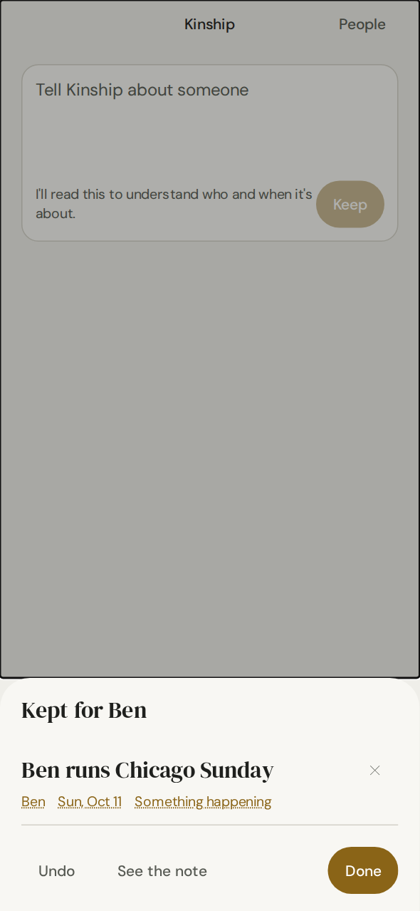 Something to look over | 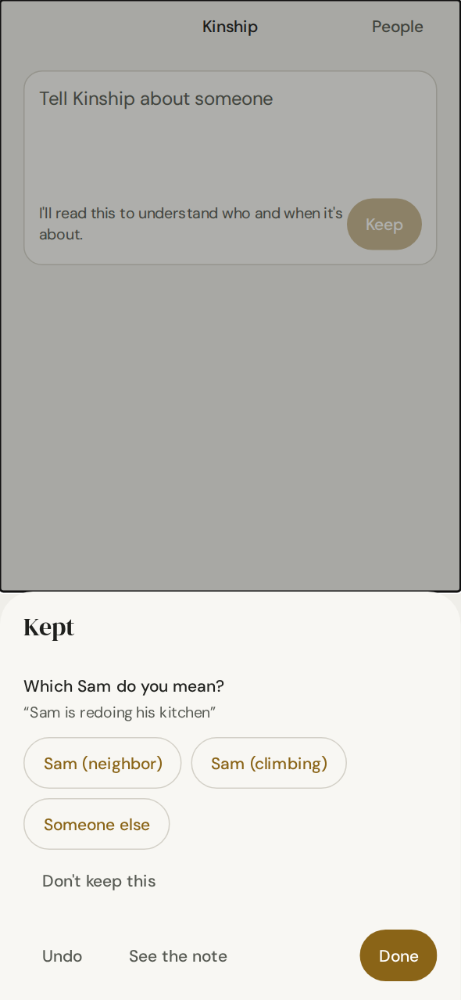 One question: which Sam |
| 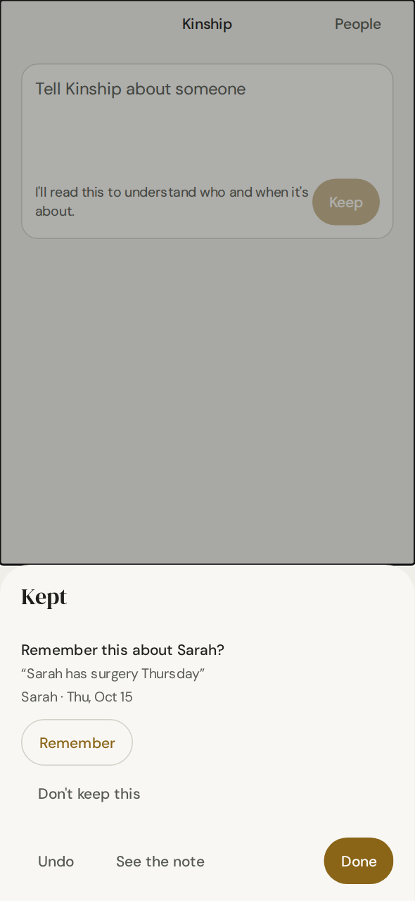 A sensitive reading waits for "Remember" | |
| 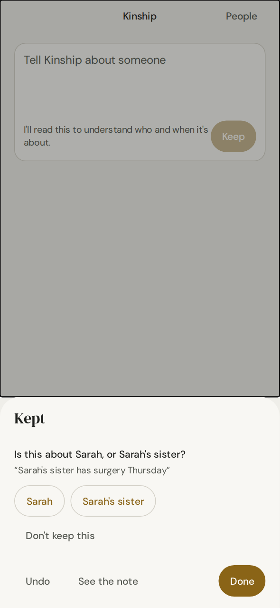 Sarah or her sister | 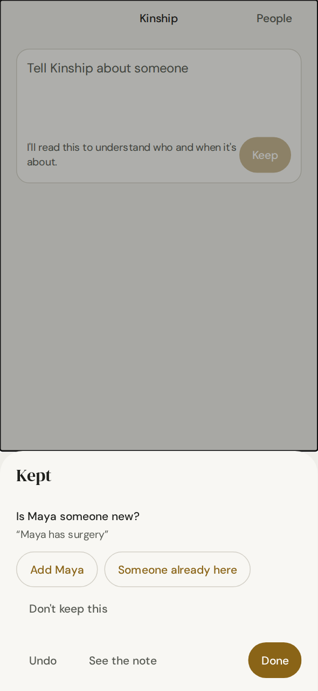 Someone new |
| 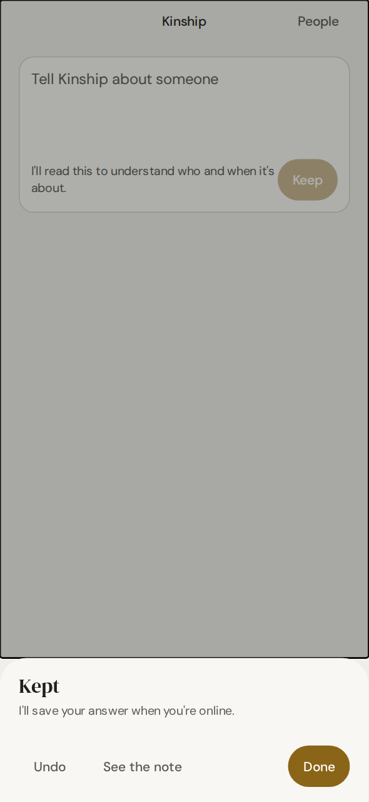 Answer waiting to be online | 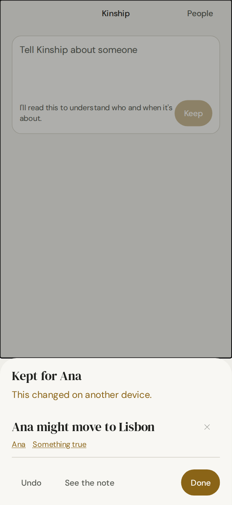 Changed on another device |
| 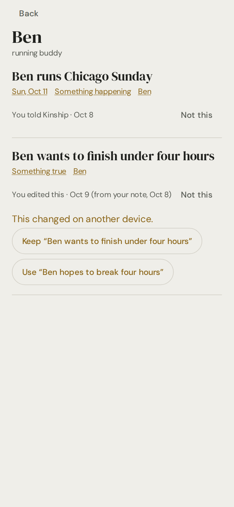 A person's record, with sources and a conflict | 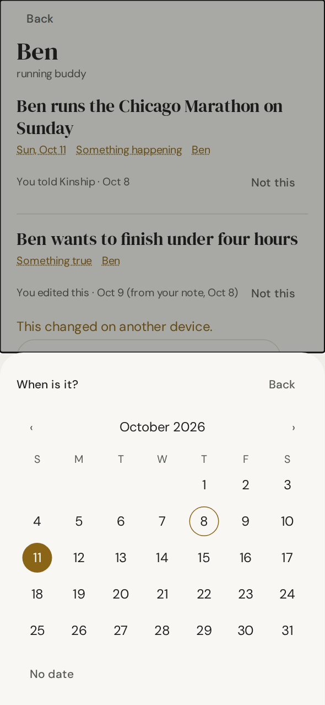 Changing a date |
| 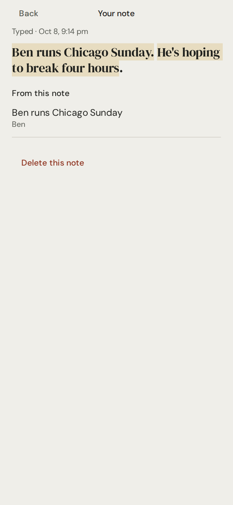 The Source view | 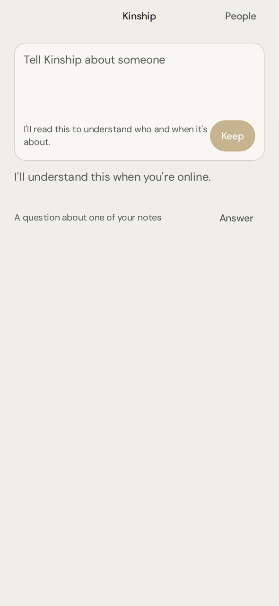 Offline, with a question waiting |

## 5. Offline and restart (D1.8)

The `understanding` row is written before anything leaves the device, so every interruption resumes:

| Interruption | What happens | Test |
|---|---|---|
| Told offline, then the app is killed | The note and its place in line survive. It is understood once online | `Ben … across relaunches` |
| Extraction finished but the reply was lost | Asking again returns the stored reading ("done"). No second model run | `recovers a reading whose reply was lost` |
| Killed before answering | The question is still there, read from the device | `two Sams …` |
| Answer reply lost | The answer stays queued; the retry gets `already_resolved`; written once | `an answer whose reply was lost` |
| Answer given offline | Kept on the device and sent when online | `an answer given offline` |
| Done tapped offline, then killed | Confirmations go out through the outbox; the close is delivered later | `a light confirmation … relaunch` |
| Killed with the sheet open | After 10 minutes it is finished as left; items stay unreviewed. A question is never closed for the user | `left open when the app was killed`, `a question is never closed` |
| Answered differently on another device | That answer stands. "This changed on another device." | `answered differently on another device` |
| Note edited on another device | The answer isn't applied to different words. The held part is let go, the note is kept, and the user is told | `the note changed on another device` |
| Chosen person removed meanwhile | Asked again ("Choose again"), nothing written | `someone removed meanwhile` |
| Server trouble | Retried with growing waits (15 s → 1 h). After 6 failures the note is kept as written. An answer is never dropped | `server trouble …`, `the user's answer is never dropped` |
| No consent, or AI switched off | Kept as written. No model call, no retries | `without AI consent …` |

## 6. Provenance and correction (D1.6)

- Every saved item has a capture source with its span and a ≤ 200-character quote. The person's record shows "You told Kinship · Oct 8", "· and 2 other notes", or "You edited this · Oct 9 (from your note, Oct 8)". Tapping the line opens the Source view: the note with its evidence marked, how and when it arrived, and everything it produced.
- **Correction:** `MemoryRepo.correct` adds a `user_edit` source and marks the item edited. The server never merges into or supersedes an item the user wrote or edited (`write_extraction` treats both as protected targets; pgTAP 56 and 59 prove it for user-written items).
- **"Not this"** retracts and removes.
- **Undo** retracts what the note alone created and deletes the note. A memory it only added to keeps its other sources.
- **New in D1** (`20261004140000`): when an item that replaced another is taken back (Undo or "Not this"), the replaced item returns as it was. Its status and `valid_to` come from its history snapshot, unless another live item still replaces it; down a chain, the nearest live item comes back. It runs as the caller, so it only ever touches the user's own items.
- **Deleting a note** (Source view) forgets what came only from it.

## 7. Instrumentation (D1.7)

All events are content-free and typed. Values are closed enums, booleans or counts up to 10. They are documented in `docs/ops/analytics.md`.

| Event | Props |
|---|---|
| `capture_started` / `capture_completed` / `capture_abandoned` | source, chars bucket, offline |
| `extraction_completed` | items (0–10), tier (auto/light/clarify/none), latency bucket, model (primary) |
| `review_item_shown` / `review_item_accepted` / `review_item_rejected` | tier (auto/light; later for rejections outside a review), item kind |
| `extraction_corrected` | correction (person/date/kind/statement), item kind |
| `clarification_shown` / `_answered` / `_dismissed` | type (person/relation/new_person/date): the coarse reason category |
| `review_left` | how (done/idle/dismissed), question waiting |
| `review_reopened` | question waiting |
| `undo_capture`, `deletion_completed` (capture) | none / scope |

Never logged: note text, names, statements, evidence quotes, person ids, capture ids or free text. A test drives the Ben and two-Sams flows and checks every value sent (`analytics … no text, names or ids`). The PostHog sink stays off unless a build enables it.

## 8. Dogfood status (D1.9): merged and deployed; ready for named accounts

**Merge.** D1 merged as [fullcarts89/kinship#14](https://github.com/fullcarts89/kinship/pull/14) with "Create a merge commit" (`8415943`, 4 Oct 2026 19:10 UTC). All seven checks were green, including Supabase Preview.

**Migrations.** The GitHub integration applied `20261004130000_v2_resolve_capture_review` and `20261004140000_v2_restore_superseded`, giving 24 migrations in both production and the repository. The schema fingerprint is `d97fda4fd9427cffc4351c0133e112f3` (779 lines) in production and in a fresh build of merged `main`.

**Gateway.** `ai-gateway` v2 was deployed from `main` (`8415943`) with JWT verification on. It carries the 16 files of its import closure, including the new `_shared/extraction/acceptance.ts`. **Parity:** every deployed file was retrieved and compared mechanically, and all are byte-identical to `main`; ezbr `42d8601d…`. Probes without a valid user token return 401. Prompt v5, the pipeline, the registry, the model and the output schema are unchanged from v1.

**Flags.** `shell_v2`, `tell`, `ai_extraction` and `memory_v2` are all off everywhere (default off, rollout 0%). `user_flag_overrides` is empty. **Internal accounts enabled: 0.** Enabling them waits on two things only the founder can provide:

1. **Named internal accounts.** Give 2–5 user ids (never looked up by email).
2. **A dev or TestFlight build of `main`.** No EAS or TestFlight access exists in this environment.

**Enablement, with the service role, once the ids are named:**

```sql
insert into user_flag_overrides (user_id, flag_key, enabled)
select u.id, f.key, true
from (values ('<uuid-1>'::uuid), ('<uuid-2>'::uuid)) as u(id)
cross join (values ('shell_v2'), ('tell'), ('ai_extraction'), ('memory_v2')) as f(key)
on conflict do nothing;
```

**Rollback** is `delete from user_flag_overrides where user_id in (…)`. A device that already cached "off" switches shells on the launch after it has seen the change. The flags are never enabled globally.

**During the week.** Measure only with the content-free events (§7). Keep the confirmation policy as it is for the first few days, even if the review rate is high. Retention follow-up: see §0; it is planned and not yet built.

## 9. Acceptance (Part VI)

| Case | Result | Where |
|---|---|---|
| **Ben** ("Ben runs Chicago Sunday. He's hoping to break four hours.") | Told offline and kept; killed and relaunched; understood once online (one model run); the event (Sun, Oct 11, "break four hours") is on Ben's record with its source (span 0–24, quote kept); relaunched again and still there | `understanding.test.ts › Ben …` |
| **Two Sams** ("Sam is redoing his kitchen.") | One question ("Which Sam do you mean?") with both Sams told apart; nothing remembered for either until answered; killed before answering and the question survives; answered → on that Sam only, never the other; one model run | `understanding.test.ts › two Sams`, `reviewModel.test.ts`, `ReviewSheet.test.tsx` |
| **Sensitive** | A dated health event is shown as "Remember this?" and is not memory on show, on Done, after a relaunch or after an hour; Remember writes it, Don't keep this never does; an undated one is held until a day or "No date" | `understanding.test.ts › sensitive notes …`, `handler.test.ts`, `resolve.test.ts` |
| **Correction** | Date, words, kind and person changed: each is the user's (`user_edit` source, `edited`), with valid detail, and synced; analytics carry the correction type only | `corrections are the user's word` |

## 10. Tests (Part VII)

| Suite | Count | Status |
|---|---|---|
| Deno (edge functions) | 117 | all pass; `deno check` clean |
| Eval | corpus manifest + baseline replay | pass (no paid run) |
| pgTAP | 409 in 16 files | all pass (31 resolve, 12 restore new in D1) |
| Jest | 234 in 37 suites | all pass (60 new in D1, including the grounding regression) |
| tsc / ESLint | — | clean (no new warnings) |

D1 adds:

- **Isolation:** the resolve action is service-role only, scoped to the verified user, and refuses another user's capture or person (pgTAP 59). The restore trigger touches only the caller's items (pgTAP 60). A device never uses another account's flags.
- **Resolve idempotency:** pgTAP 59 and the lost-reply test.
- **Provenance:** sources, quotes and the Source view runs.
- **Content-free analytics.**

## 11. Choices made in D1 for your review

1. **Routes live at `/v2/...`, not an `(v2)` group.** The 1.0 tree owns `/person/[id]` and `/people`. They move with DEL-10.
2. **Flags are read cache-first.** A change applies on the next launch after the app has seen it, which keeps launch instant offline. Unknown is off.
3. **Done confirms what the user saw** (`user_state = confirmed`). Idle or dismissal leaves items unreviewed.
4. **Leaving a question unanswered keeps it waiting**, quietly, and it can be reopened. "Don't keep this" is the explicit skip.
5. **The analytics schema was extended** with the review events, and `extraction_corrected` now uses the 2.0 kinds. Plan §23's table predates them; `docs/ops/analytics.md` is current.
6. **People can be added by name on the People screen**, or from a note ("Add Maya"). Onboarding and Contacts import remain E16.
7. **Kind changes are limited to six kinds.** Promises stay promises, and an item about someone's relative can't be moved to another person.

## 12. Known issues

- **core-083** (accepted, CC-10) is unchanged.
- **Unopened light-confirmation notes keep the server waiting.** A note understood while away and never opened stays `needs_review` on the server, and a "delete after" note keeps its text until the review is opened and left. A server-side settle for `needs_review` captures with no review after N days is recommended, alongside scheduling `purge_expired_capture_reviews` and `purge_tombstones` (pg_cron, open since C).
- **No new Sam from an answer.** A question about "Sam" offers the user's Sams and "Someone else", but not adding a third Sam from the answer: the gateway allows "someone new" only for a name the note introduced.
- **No re-reading after a note edit.** If the note's words change after its question was asked, the held part is let go rather than re-read.
- **Notes can't be edited in the 2.0 shell yet** (Source view: delete only).
- **Not verified on a device in this environment.** That covers fonts, Modal and keyboard behaviour, VoiceOver and Dynamic Type. Do it first in dogfood.
- **No Today line.** Notes understood while away surface as a quiet line on the Tell screen (Today is out of scope).
- **One wait on the first launch after install.** With no flags kept on the device yet, the launch waits for the server's answer before choosing a shell: up to 2.5 s, or less if it fails fast offline.
- **Static web rendering of the whole app fails** (expo-sqlite's wasm import, pre-existing since Checkpoint B). It is irrelevant to iOS and Android; the lab renders client-side.

## 13. Recommendation for the next slice

**Dogfood D1 internally first** (a week, 2–5 accounts), after merge and deploy. Then make one evidence-led change to confirmation friction, CC-12's ~52% light-confirmation rate: the new events give, per kind and flag family, how often light items are accepted unedited, corrected or rejected. Flags that are almost always accepted unedited are candidates to save quietly. That change is a policy decision for you, made with the eval gates held.

Alongside it, as small follow-ups:

- the server-side settle for unopened notes;
- the pg_cron schedules;
- the on-device accessibility pass.

Today, reasons and the rest of D wait for your go-ahead.
