# Founder native-pass feedback, round 2: summary and recommendations

**Build:** recovery build (`dogfood-v2`, iOS), ai-gateway v3, branch `claude/awesome-edison-3cuf6z`
**Session:** 5 October, 12:57–2:46 pm, on the founder's iPhone
**Status:** logged only. Nothing has been changed in response; each item waits for the founder's go-ahead.
**Readiness:** **NOT READY.** Results from Tell don't reliably appear or stay on screen (theme A), and "the writer" can still reach a page (theme B).

The item-by-item log, in the order things came in, is `founder-native-feedback.md` (G1–G43, section "Second native pass"). This summary groups the same items by theme and priority. Every item has a recommendation; none is built. Where a cause is marked *likely*, it comes from reading the code only. No data was checked after you asked me to stop (G7 and G8 include two read-only checks made before that).

Screenshots are embedded here (originals in `screens/feedback2/` in the repo). Items without a screenshot were described in words.

---

## At a glance

| Priority | Theme | Items | Decision needed from you? |
|---|---|---|---|
| **Blocking** | A. Tell results don't reliably show up, or vanish before you can act | G4, G5, G6, G11, G14, G16, G19, G29 | No: bugs |
| **Blocking** | B. Wrong voice: "Writer…", "their daughter", a leftover "He" | G26, G32a, G33, G37 | No: bugs |
| High | C. Trust: contradictions, wrong attachments, consent | G15, G38, G39, G42 | No: bugs |
| High | D. Feedback after Tell: slow, silent, inconsistent, unclear | G1, G2, G3, G7, G9, G10, G22, G41, G43 | **Yes:** what the confirmation means (G10, G41) |
| High | E. New news should update old news | G30, G31, G35, G36, G40 | Yes, for a data-shape change (G31) |
| Medium | F. Several people in one note; people not in People | G8, G20, G23, G24, G25, G34 | Yes: relationships to you (G8); "Both" data shape (G23) |
| Medium | G. Today: missing moments, contradictory headline | G12, G13, G21, G27 | No (G21 needs an eval) |
| Medium | H. Person page readability | G17, G18 | Only beyond spacing and weight |
| Direction | I. "About you" | G28 (and G40's idea) | **Yes:** a new surface |

**Worked well this round:** "which Sam?" was caught (G19); Allison's Austin → Denver replaced correctly (G40); uncertainty kept in the wording ("thinking about", "planning on") (G36, G38); dates resolved ("Friday" → Fri Oct 9) (G43); correcting a kind picked up the date (G35); holding unclear notes until confirmed ("that's actually a good feature", G13).

---

## A. Tell results don't reliably show up (blocking)

**What you saw.**
- A fact sat for 30+ seconds and never appeared (G4). The same happened twice for "John and Ben are brothers" (G11).
- The app froze twice (G5, G14).
- "See the note" came back to nothing (G6).
- Confirmation sheets "bounce away" before you can tap anything, both after answering "which Sam?" and from Today's Tell field (G19, G29).
- A note still being understood shows nowhere on Today (G16).

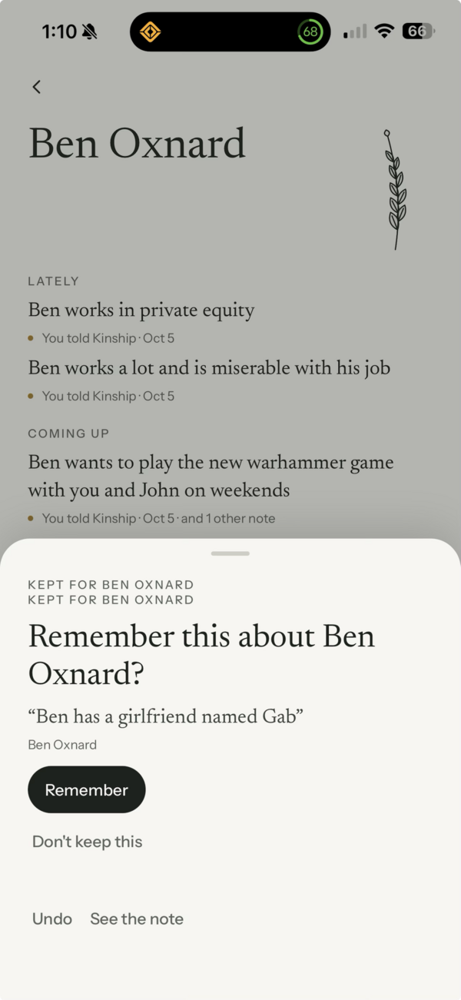 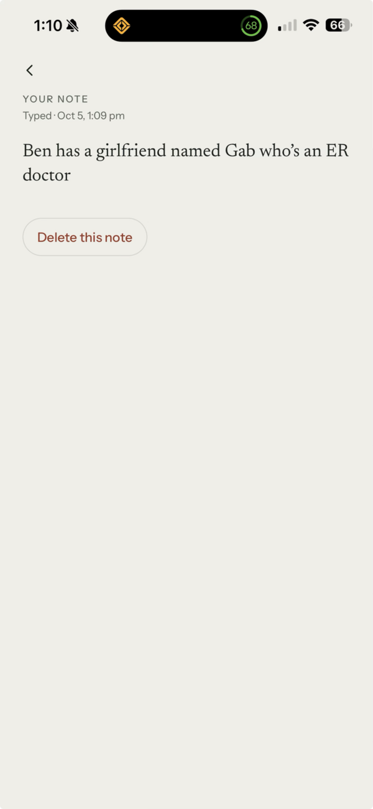

*G6: the Gab question, then "See the note"; coming back, the question was gone.*

**What I found.**
- **Server timing is fine.** G4's answer was ready in 8 s (checked before you asked me to stop); the phone just didn't show it. This is client-side.
- **There's a pattern.** Every freeze and every silent wait came after a note about someone *not in People* or a *relationship between people* (Gab; John and Ben; Amanda and Luna), with earlier questions still unanswered. Notes about one known person worked.
- **Three places can close a sheet without a tap** (`TellFlow.tsx`):
  - **(a)** if the review is briefly "nothing to show" during a refresh, the sheet closes for good;
  - **(b)** the 20 s idle close;
  - **(c)** swipe or tap outside.
  
  "Bounces away" (a second or two) points at (a). A fourth candidate is the keyboard closing as the sheet opens.
- **Correction to G6.** Re-reading the code, closing a sheet with a question keeps the question waiting on the phone rather than discarding it. So G6 is most likely "the question closes and never comes back", the same root as G19.
- **No screen shows a note that's still in progress.** Today's question line counts only notes already understood. A note still on its way (or interrupted by a freeze) shows nowhere (G16), and person pages don't show waiting questions at all.

**Recommendations.**
1. **Reproduce first, in a test and on device:**
   - several questions left unanswered, then a note naming new or related people;
   - a refresh while a sheet is open;
   - sending from Today with the keyboard open.
2. **A sheet with a question, or a confirmation that follows an answer, never closes by itself.** No idle timer, no close on a passing refresh. It closes only on an answer, Done, "Not now" or a deliberate swipe. During a refresh it keeps the last content.
3. **Every note is always accounted for, on Today and on the person's page:**
   - "Still understanding a note about Tyler…";
   - "Which Sam? · Answer";
   - if it fails: "Couldn't understand this one. Your note is saved."
4. **A note interrupted by a freeze or restart resumes by itself** when the app opens.
5. **Find and fix the freeze.** Next time it happens: which screen, and whether it recovered or needed a force-quit.
6. **Record content-free timings** (sent → understood → shown), so a gap like G4 shows up in analytics.

---

## B. Wrong voice (blocking, trust)

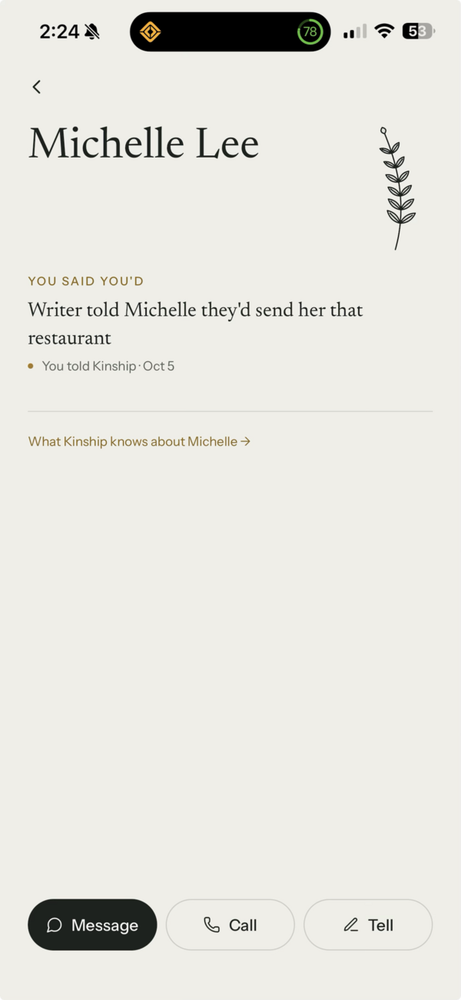 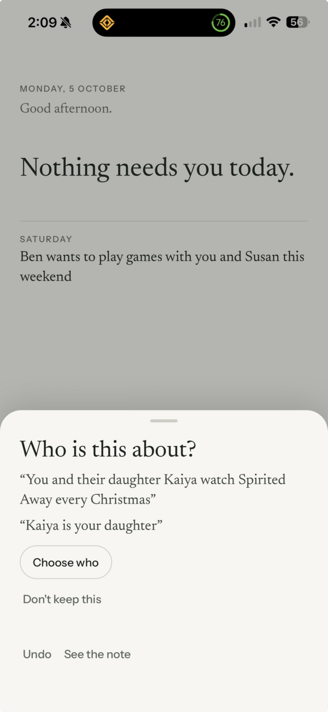

*G33: "Writer told Michelle they'd send her that restaurant". G26: "You and their daughter Kaiya…".*

**What I found.**
- **"Writer" slips through (G33).** The rewrite and the leftover check in `voice.ts` only catch the phrase with "the" in front ("the writer"). The model wrote "Writer told…", so it went through untouched. The trust tests use the same narrow pattern, which is why they didn't catch it.
- **"Their" stays (G26).** "The writer and **their** daughter" becomes "you and their daughter": "the writer" is rewritten, but the "their" that refers back to you isn't. That changes whose daughter Kaiya is.
- **"He" stays after you answer (G32a).** When you answer who "he" is, the line is filed on John but still says "He wants to go back to Tahoe in December".
- **The People list repeats both (G37).** The previews show the same wording bugs.

**Recommendations.**
1. **Widen the net.** Catch writer, user, author or narrator meaning you, with or without "the", in any case, including possessives. Carry a following they, their or them over to you or your.
2. **Add a last check before anything is saved or shown.** If a line still names you that way, rewrite it or fall back to your own words. Never show it as is.
3. **After a who-answer, put the name in.** "John wants to go back to Tahoe in December".
4. **Write promises in your own voice:** "Send Michelle that restaurant".
5. **Fix stored lines at display time** the same way.
6. **Add tests for these exact sentences,** and widen the trust tests' pattern.
7. **Add a prompt rule for the next eval:** never name the author with these words, and never use "their" for the author.

---

## C. Trust: contradictions, wrong attachments, consent

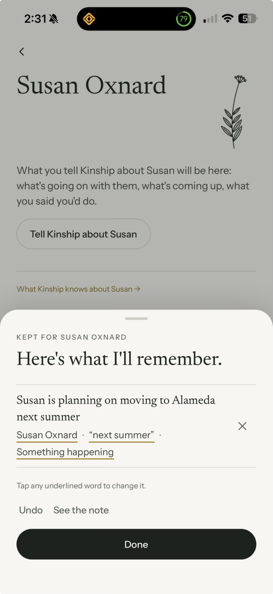 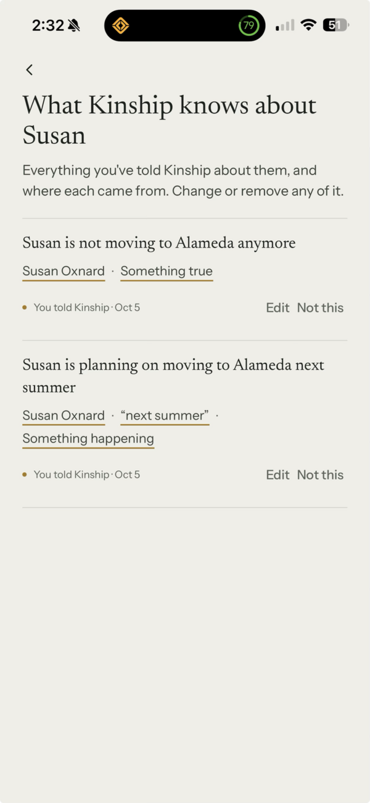

*G38: "planning on moving to Alameda" and "not moving to Alameda anymore", both current.*

**G38: a cancellation doesn't close the plan it cancels.**
- **Likely cause:** a rule in `pipeline.ts` (`SUPERSEDE_FROM`). A fact may only replace a fact, and only something ongoing can be closed by a firm answer. "Not moving anymore" is a fact; the move is an event, so the code refuses the replacement and keeps both. The same rule would block "the wedding's off".
- **Recommendation:**
  - a firm cancellation closes the event, plan or thread it cancels (same person, same subject), moving it to history with its source;
  - the page never shows both as current;
  - if it's unclear which line is cancelled, ask "Close …?";
  - reminders for a closed plan stop.

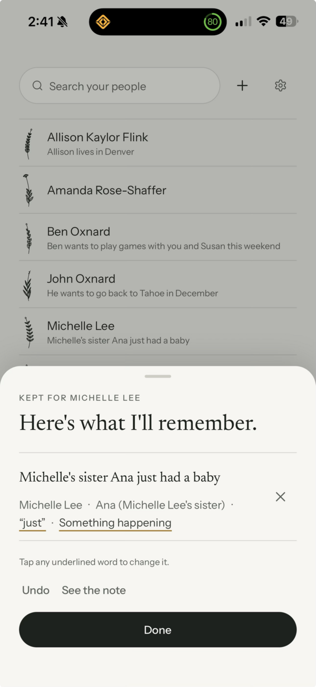

*G42: Ana's baby, shown as a Michelle line.*

**G42: someone else's news shown as if it were Michelle's.** Kinship actually filed it as being about Ana, Michelle's sister ("Ana (Michelle Lee's sister)"). The problem is that on Michelle's page and in the People list it reads as Michelle's own news.
- **Show whose news it is:** "Michelle's people · Ana (sister) had a baby · Oct 5".
- **Offer "Add Ana?"** without blocking.
- **Turn "just" into about today,** save the birth as a milestone, and suggest "Congratulate Michelle".

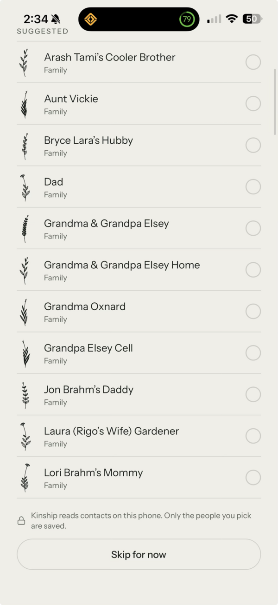

*G39: everyone labelled "Family".*

**G39: contacts are called "Family" because of a word in the name.** `looksLikeFamily` matches words like "Hubby", "Daddy" or "Wife" anywhere in the name, including "Bryce Lara's Hubby" and "Laura (Rigo's Wife) Gardener".
- **Possessive names never mean family.** Only a leading word ("Dad", "Aunt Vickie") can suggest family.
- **Don't claim the relationship.** Show "Saved as Dad", or no label.
- **Show duplicates once.** "Grandma & Grandpa Elsey", "…Home" and "Grandpa Elsey Cell" are the same people.
- **Add tests with these exact names.**

**G15: the consent sheet flashes after sign-in, and swiping it away means "decline".** No screenshot. After sign-in, the phone hasn't yet received your earlier "Allow", so it asks again, then the sheet closes when the answer arrives. Worse, swiping or tapping outside the sheet records "Keep notes as written", which turns understanding off.
- **Don't ask until the phone knows the account's answer,** and never ask an account that has already answered.
- **Once shown, it stays** until you tap one of its buttons.
- **Swiping is never an answer.**
- **Add tests for both.**

---

## D. Feedback after Tell: slow, silent, inconsistent, unclear

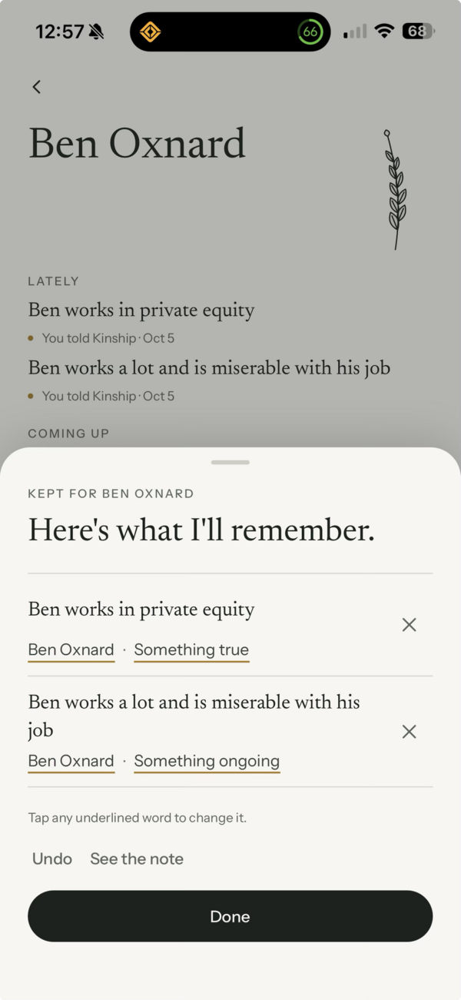 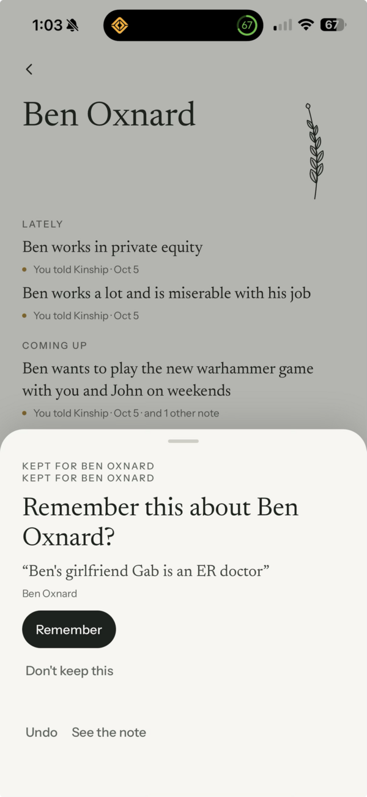 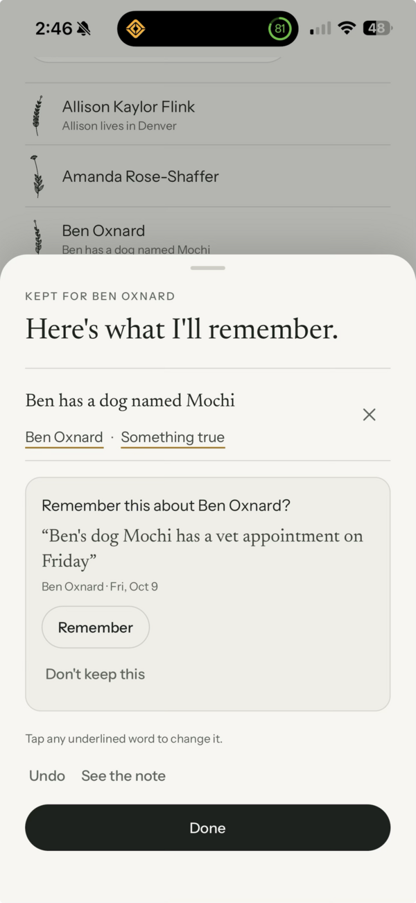

*G1: the review sheet after a silent wait. G3: "Kept for Ben Oxnard" twice. G43: a kept line and a held line mixed together.*

| Item | What happens | Recommendation |
|---|---|---|
| **G1, G2: silent wait** | 6–9 s with no sign of work on a person's page. The model call is 4–6 s; the app adds about 2 s. | "Understanding…" where you sent it from, right away. App side: send at once and apply the answer directly (saves 1–2 s). Model side (leaner output, or a faster model) only after a paid eval you authorise. |
| **G3: label twice** | "Kept for Ben Oxnard" is drawn twice on a question-only sheet. | Draw it once, and say "About Ben" while nothing is kept yet. |
| **G7, G10: sometimes a sheet, sometimes not** | Clear, confident notes get only a 5 s "Kept" line; less certain ones get the sheet. The rule is invisible, so it feels random (reproduced). | **Decision:** one consistent "Kept for Ben · …" card after every note. It lists what was kept, you tap a line to edit, and it has Undo. It stays until you scroll, leave or tap. The full sheet appears only when Kinship must ask, and says why. *Recommended over "always the full sheet".* |
| **G9: Kept line on the wrong page** | Ben's "Kept" line showed on John's page (one app-wide line). | Show it only on the page of the person it's about (and on Today / People). Elsewhere, name the person. |
| **G22: "Kept" before it's understood** | "Kept", then "Understanding…", then the sheet. | "Understanding…" first, then either the card or the sheet. Never say "Kept" before anything is kept. |
| **G41: kept when you left the app** | A look-over sheet's lines are already saved; it closes itself after 20 s, and the timer runs out while you're in another app. | **Decision:** (A) a look-over that says so honestly ("Kept for Michelle · tap to change") and pauses while you're away. *Recommended,* with sensitive, unclear or new-person items still waiting for a yes. Or (B) nothing is kept until Done. |
| **G43: what needs me?** | A kept line (✕ and underlines) and a held line (Remember / Don't keep) mixed together, with no reason given. A pet's vet visit is held like a health appointment. | One list: what's kept, then "One to check", with the reason in plain words. Don't hold a pet's vet visit. Make Done clear ("Keep both", or "the rest waits on Today"). The heading says "About Ben" while something waits. |

---

## E. New news should update old news

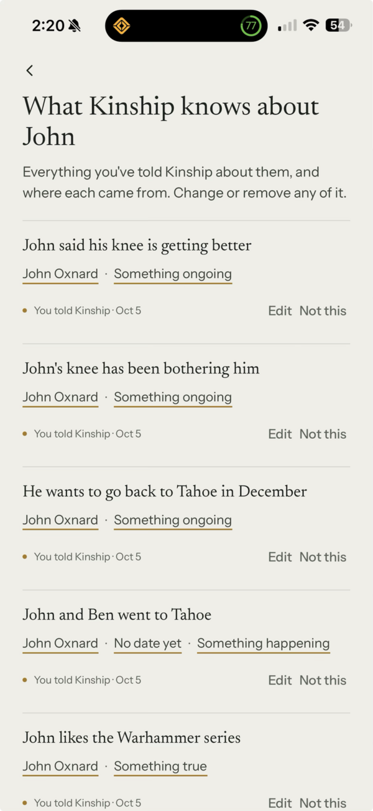 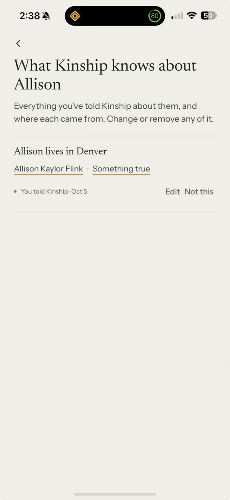 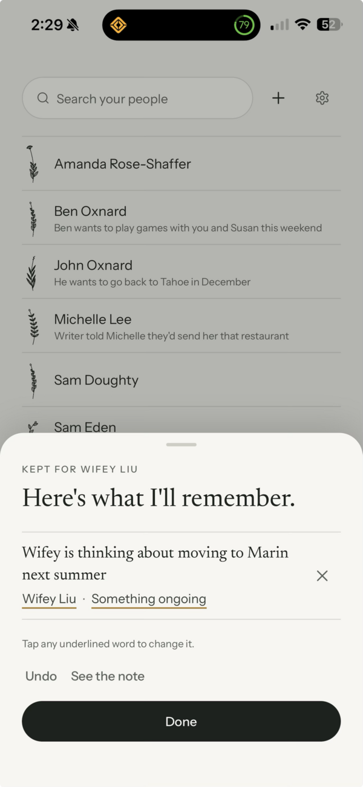

*G31: two parallel knee lines (and "He wants…", "No date yet" on a past trip). G40: Austin → Denver replaced correctly. G36: "thinking about" kept.*

| Item | What happens (from the code and prompt) | Recommendation |
|---|---|---|
| **G30: "got the Stripe job" vs "interviewing"** | "Which Sam?" means the model can't see either Sam's facts. Your answer is then applied with **no model call**, so the news is filed as new and nothing is replaced. | After a who-answer, compare again with that person's facts. "Got the job" closes "interviewing" (moved to history) and gives "Sam works at Stripe" plus a dated milestone. The confirmation shows "interviewing → works at Stripe". |
| **G31: knee "bothering" → "getting better"** | The prompt only allows a *firm* update to replace something, so progress becomes a second line. | Progress updates the line in place, keeping its history; a clear end closes it. If unsure, ask: "Update …?". The page shows the latest state; check-ins follow it. *Needs a data shape for history, for your yes.* |
| **G35: "Tyler said he'd send me … Wednesday"** | There's no category for someone's promise *to you*, so it became "ongoing" and the date was lost. Correcting the kind fixed it. | A "Waiting on Tyler · Wed" line, then a gentle "Did Tyler send it?" if the day passes. Never drop a date the note gives. |
| **G36: "thinking about moving to Marin next summer"** | The wording kept the uncertainty (good). "Next summer" isn't saved as a time, and "Something ongoing" doesn't say "maybe". | Keep and test the uncertainty rule. Save "summer 2027" as a season, with a spring check-in. Use a plainer label ("Maybe, later"). |
| **G40: Austin → Denver** | Replaced correctly. The old fact is kept as history but invisible and unused. | Show it quietly ("Before: lived in Austin"). A replaced place stays useful as "used to live in Austin" (see I). |

Theme E mostly needs prompt rules, so a **paid eval** you authorise, plus the code fixes noted (G30, G38).

---

## F. Several people in one note; people not in People

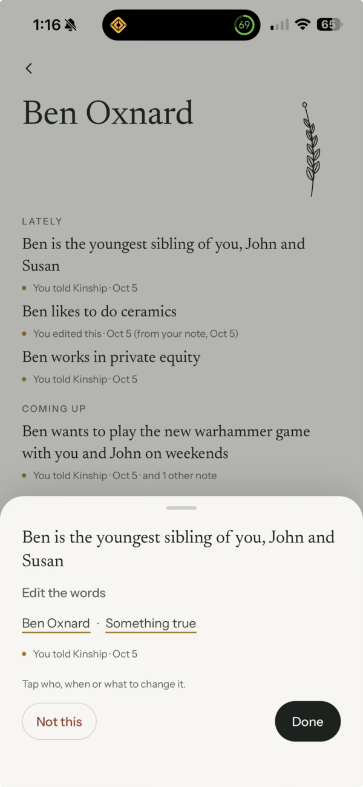 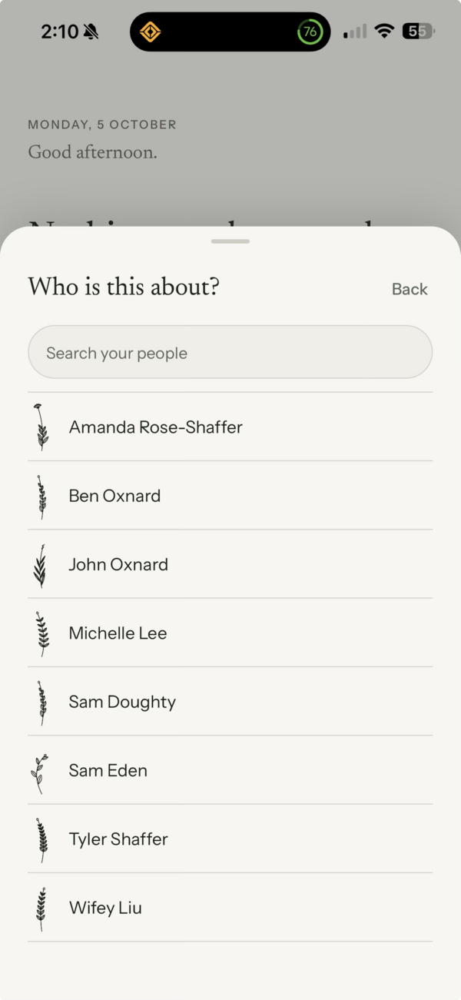

*G8: "youngest sibling of you, John and Susan", filed on Ben only. G25: "Choose who" lists People only; there's no "Add Kaiya".*

| Item | What happens | Recommendation |
|---|---|---|
| **G8: siblings note** | One fact on Ben only: John isn't linked, there's no "Add Susan?", and your own relationship isn't recorded. | Show everyone it involves ("Also about: John Oxnard · Susan · Add"). Link people already in People when the name matches exactly one person. Ask once: "Ben, John and Susan are your siblings? Add Susan?" *Decision:* offer to record relationships to you, always as a question (recommended yes). |
| **G20, G34: Michelle added after "Sam is married to Michelle"** | A newly added person is never connected to a matching person mentioned earlier. | "Is this the Michelle who's married to Sam?" Never merge silently. |
| **G23: "Ben and John went to Tahoe. He wants to go back."** | There's no "Both" option, and a line belongs to one person. | Shared moments go on both pages with no question. A "he/she" question offers each person **and "Both"** and quotes the sentence. *A data-shape decision for your yes.* |
| **G24: the Warriors tradition isn't on Amanda's page** | Likely waiting, or filed on "Tyler's wife Amanda" (G20). | As A and G20. A clear "together" thing goes under "Between you" with no question. |
| **G25: Kaiya (your 2-year-old)** | The question offered no "Add Kaiya", so it looked like a contact was needed. | Offer "Add Kaiya" (name only) with "your daughter". Close family never needs a phone number. |

---

## G. Today

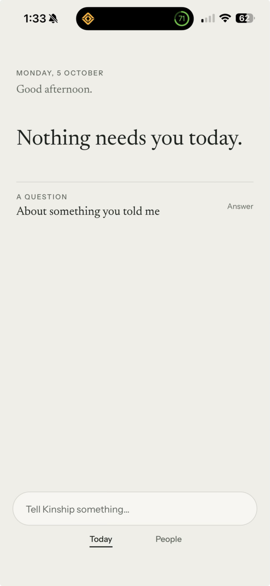 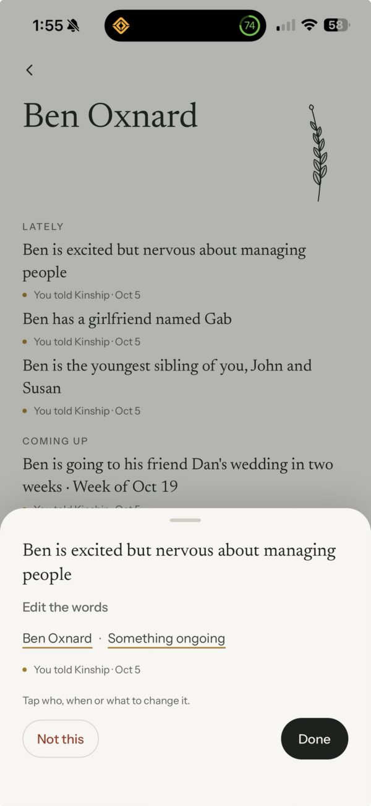 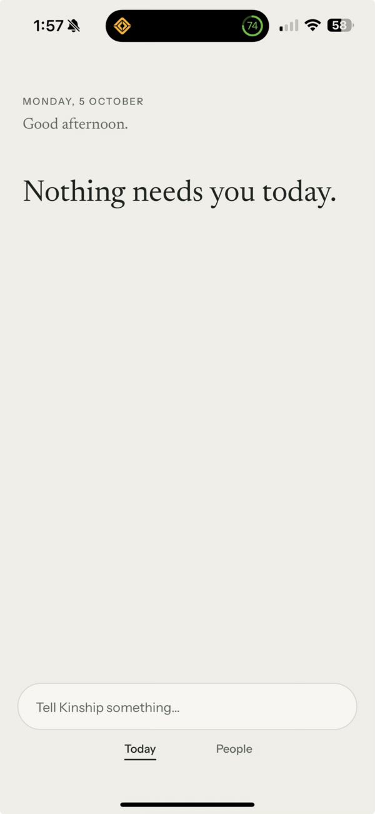

*G13: "Nothing needs you today." above a waiting question. G21: the promotion note, and a Today with nothing.*

- **G13: waiting questions are easy to miss** (you like that unclear notes wait for you).
  - The headline stops saying "Nothing needs you today." when something is waiting.
  - Each waiting note gets its own line saying who and what ("Is Gab Ben's girlfriend? · Answer"), a few at most.
  - The same line shows on that person's page.
  - It stays quiet: no badges.
- **G21: "Ben got promoted yesterday."** The promotion was held for your yes and showed up on Today later; only the feeling was kept at once. There's no "good news" moment on Today.
  - One note, one review: show all its lines together.
  - Save the promotion as its own dated line (Oct 4).
  - Add a new Today moment for recent good news: "Ben was promoted yesterday · Congratulate him · Message", for about 1–3 days, then a later "How's the new role?".
  - The prompt part needs an eval.
- **G12: Amanda's first day at a new job (today).** Job starts only get a check-in *after*, and Amanda wasn't in People.
  - A nudge on the day ("Amanda starts her new job today · Message Tyler").
  - Remember a related person on Tyler's page without needing a question.
- **G27: smaller things.**
  - The headline contradicts what's below it (as G13).
  - Susan isn't in People (G8).
  - Questions should quote the sentence they're asking about.

---

## H. Person page readability

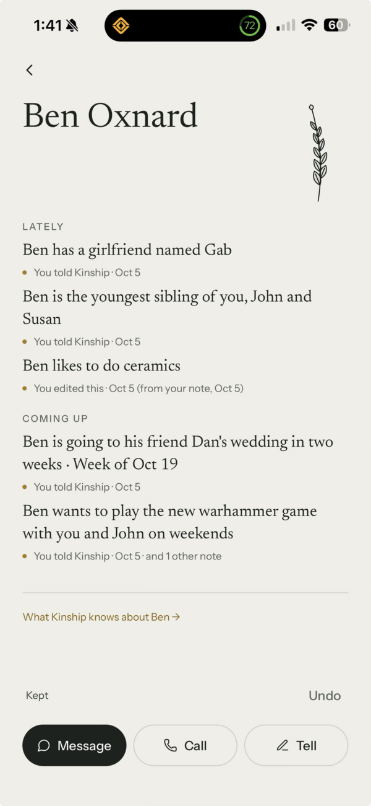

*G17: Lately and Coming up blend together.*

- **G17: sections blend into a wall of text.** Within the approved look:
  - more space between sections than within them;
  - a thin line above each label, and the labels a step darker;
  - "You told Kinship · Oct 5" only where it adds something;
  - Coming up leads with when it is.
  
  Anything beyond spacing and weight is checked against the approved boards and comes to you.
- **G18: smaller things.**
  - The Kept line says only "Kept", not what (the G10 card fixes this).
  - "In two weeks" is stored in the sentence and will go stale: save the date and work out "in two weeks" when it's shown (needs an eval).
  - "Ben works in private equity" dropped out of Lately; confirm the cap is intended.

---

## I. Direction: "About you" (decision)

**G28.** You asked: if Kinship keeps things about you (Kaiya is my daughter), shouldn't they be associated with you, and inform how you show up for others? For example: you like basketball, and Amanda is going to a game.

Today there's no "you": a fact only about you has nowhere to go.

**Recommendation:** a small, private About you, filled only from what you tell Kinship:
- your people ("Kaiya · your daughter"), what you love, your traditions;
- relationships to you need your yes;
- used as plain-words reasons, such as "Amanda's going to the Warriors game Saturday. You both love basketball · Message her", or, with G40's history, "Allison used to live in Austin · Ask her for restaurant ideas";
- never a score; nothing inferred about sensitive topics; you can see, edit and delete everything.

It's a new surface, so it needs your yes, an entry in `approved-design-coverage.md`, and a design pass first. **Suggested order:**
1. "Add Kaiya" and relationships to you, with no new surface.
2. The About you page.
3. Using it in Today's reasons, after an eval.

---

## What I need from you

1. **G10 and G41:** one consistent "Kept for …" card, with the full sheet only for questions, and "look-over" meaning (recommended)? Or always the full sheet and nothing kept until Done?
2. **G8:** offer to record relationships to you, always as a question? (Recommended yes.)
3. **G28:** go ahead with an About you design pass?
4. **Data shapes, before any migration:** a memory shared by two people ("Both", G23); history on a thread (G31).
5. **A paid eval run** for the prompt changes:
   - promotions and good news as dated lines (G21);
   - "outcome" facts and updates (G30, G31, G38);
   - "waiting on" someone (G35);
   - seasons and absolute dates instead of "next summer" or "in two weeks" (G18, G36);
   - never "writer" or "their" for you (G26, G33);
   - a pet's vet visit isn't sensitive (G43);
   - a leaner output to cut latency (G2).
6. **Optional:** OK a read-only data check to confirm the open causes (G11, G14, G24, G29, G38). Nothing is read until you say so.

**Suggested build order once you say go:** A (results reliably shown) → B (voice) → C (trust) → D (feedback, per your decision) → E/F (updates and people, with the eval) → G/H → I.
