# Founder native-pass feedback: summary and recommendations

**Build:** `dogfood-v2` (iOS, internal distribution), branch `claude/awesome-edison-3cuf6z`
**Session:** 5 October, 9:53–10:22, on the founder's iPhone, across two accounts
**Status:** logged only. Nothing has been changed in response yet; each item waits for the founder's go-ahead.
**Readiness:** **NOT READY.** The build can't save a Tell (B1), so it can't go to wife dogfood.

The item-by-item log, in the order things came in, is `founder-native-feedback.md` (F1–F23). This summary groups the same items by theme and priority. Each item has the founder's words, the screenshot, what I found, the options, and my recommendation.

Screenshots are in `screens/feedback/`.

---

## At a glance

| Priority | Theme | Items | Decision needed from you? |
|---|---|---|---|
| **Blocking** | Can't save a Tell: the send / Keep button is missing | F2, F3, F7, F17 | No: a bug |
| **Blocking** | Broken-looking controls (Apple button, pencil button) | F1, F10 | No: a bug, probably the same cause as above |
| **Blocking** | Email sign-in bounces back to the welcome screen | F15 | No: a bug (need to know which account) |
| **Blocking** | No guidance after first sign-in; setup skipped; empty Today | F20, F23 | Partly: a guided tour and a "you" step are new scope |
| High | Facts filed on the wrong person; "the writer" | F4, F6 | Yes: your name or "your" |
| High | Facts can't be edited, only forgotten | F5 | No |
| High | An unsent note follows you everywhere | F19, F21, F22 | Yes: what happens to a draft |
| Medium | Welcome screen: wall of text, weak hierarchy | F9, F11 | Yes: carousel or animation |
| Medium | "See how it works": goals, an interactive "Yes", a step 5 | F12, F13, F14 | Yes: goals as a product concept |
| Medium | Consent screen names the AI provider up front | F16 | Yes, plus a legal check |
| Low | Paired buttons look like a selected toggle | F18 | No |
| Low | Settings › Contacts does nothing | F8 | Yes: make it useful, or remove it |

---

## 1. Blocking: you can't save what you tell Kinship

### F2 · F3 · F7 · F17: no send / Keep button, and no way to dismiss the keyboard

> "When I tell something to Kinship, there's no clear way to either submit or confirm the details… The text blocks any button to tap, and there's no way to push away the keyboard."
> "Still no way to submit a fact."
> "After logging in with another account, I selected the 'Tell Kinship one thing' option, and still I can't submit anything."

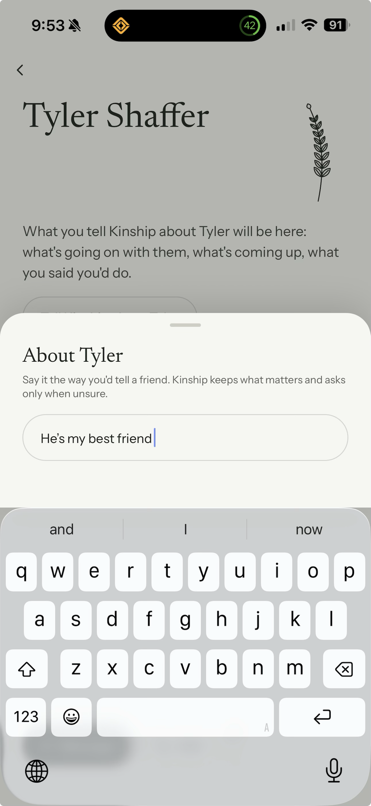 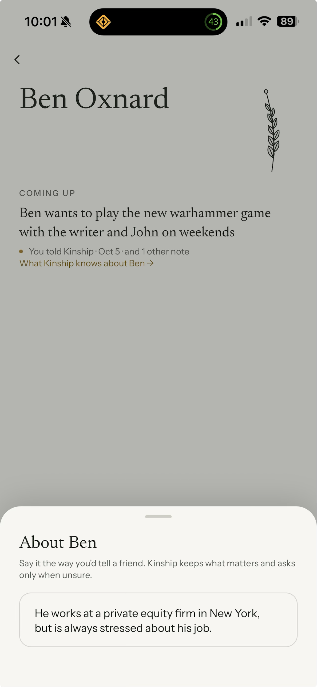 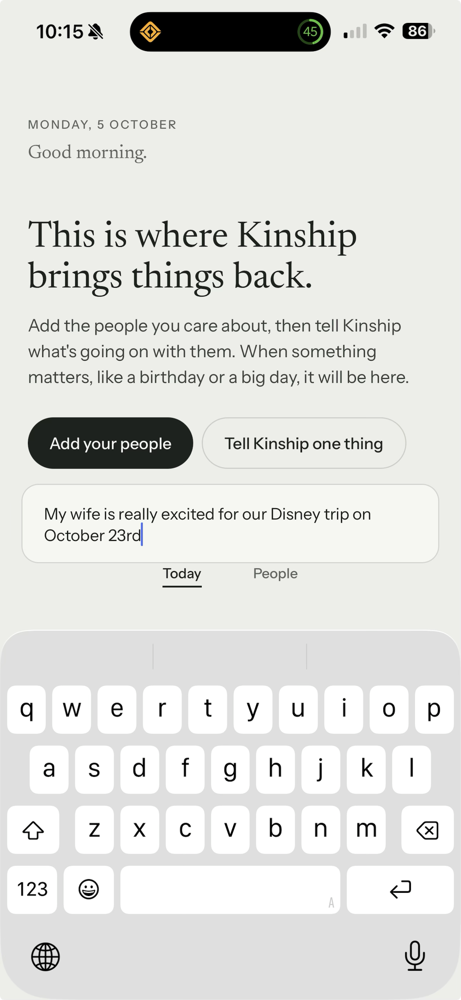

**What I found**
- The button is missing in three places: the person-page Tell sheet ("About Tyler", "About Ben"), the first-use Tell, and the Today dock.
- With the keyboard down (the "About Ben" shot), the button is still absent. So it isn't hidden behind the keyboard; it isn't being drawn at all.
- On Today, the Tell field floats about one tab bar's height above the keyboard, with the Today/People tabs between them. The keyboard lift seems to count the tab bar twice.
- There's no way to dismiss the keyboard: no "done" key, and tapping outside does nothing.

**Likely shared cause.** The app uses NativeWind, a styling library. In the phone build it may drop styles that are written as a function of the pressed state. The send button, the Apple button (F10) and the pencil button (F1) are all styled that way, and all look broken. The web preview I used for screenshots doesn't show the problem, which would explain why my checks missed it.

**Recommendation (bug, no decision needed)**
1. Confirm the cause on a device build. Then fix it once, centrally, by moving the pressed-state styling off the style function. Add a test that renders every button-like control and checks its fill and size.
2. Always show the send button whenever there's text, pinned right next to the field.
3. Make the return key or a "Done" key dismiss the keyboard. Tapping outside the field should dismiss it too.
4. Fix the double-counted keyboard lift on Today.

---

## 2. Blocking: controls that look broken or cheap

### F10: the Apple sign-in button

> "The orientation of the Apple and Google login are off. Looks cheap."

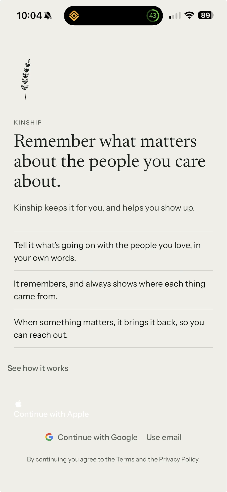

**What I found**
- The Apple button has lost its black fill: the label is white on paper, and the logo sits above the text instead of beside it. That's a rendering bug, probably the same cause as section 1.
- Google and email are small text links in a row underneath, so the sign-in area reads as unfinished.

**Recommendation**
- Fix the Apple button along with section 1.
- Then give Google the same full-width pill shape as Apple, in outline, with email as one quiet link below. That gives a standard, trustworthy stack.

### F1: the pencil (edit / add) button on a person's page

> "It would be easier if there was a clear button to edit or add details about someone. The little edit icon is too small and unclear."

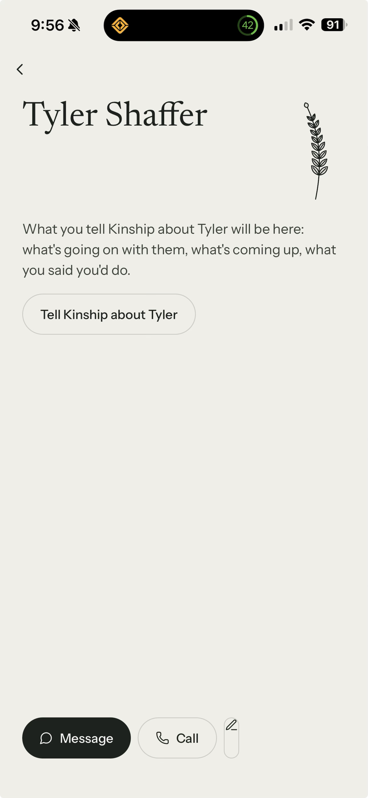 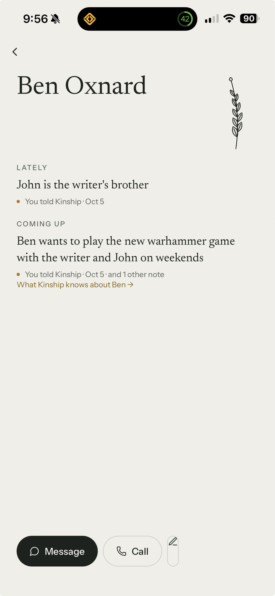

**What I found**
- The third button, after Message and Call, is a squeezed sliver with only a pencil showing. Same suspected cause as above.
- Even when fixed, a lone pencil doesn't say what it does.

**Options**
- **(a)** Give it a label: "Tell Kinship" (to add) next to Message and Call. Editing lives on each line (see F5).
- **(b)** Use two explicit actions: "Add a note" in the bottom bar, and "Edit details" in a ⋯ menu (name, birthday, contact).

**Recommendation: (a).** A labelled "Tell Kinship" in the bar, plus the empty-page button that already exists. Editing the person's details (name, birthday) goes in a small "Edit" link next to their name.

---

## 3. Blocking: signing in and the first minutes

### F15: email sign-in returns to the welcome screen

> "I just logged in my details using the email login option, but it just took me back to the login screen. Users shouldn't have to log in multiple times."

**What I found**
- No error was shown. Either sign-in worked and the screen didn't move on, or the session was lost.
- An account with the new version switched off would have opened the old app, not the welcome screen, so flags don't explain it.

**Recommendation (bug).** Tell me which email account it was and whether it was the first try. I'll read only the sign-in log entries for that attempt (no content), find the cause and fix it, and add a test that a successful email sign-in always leaves the welcome screen.

### F20: no orientation after the first sign-in

> "There is no app orientation when you first log in. No guidance on what the buttons mean… no onboarding flow to help identify who you are, what kind of a person you are, what matters to you… Every user should have guidance provided to them at least once."

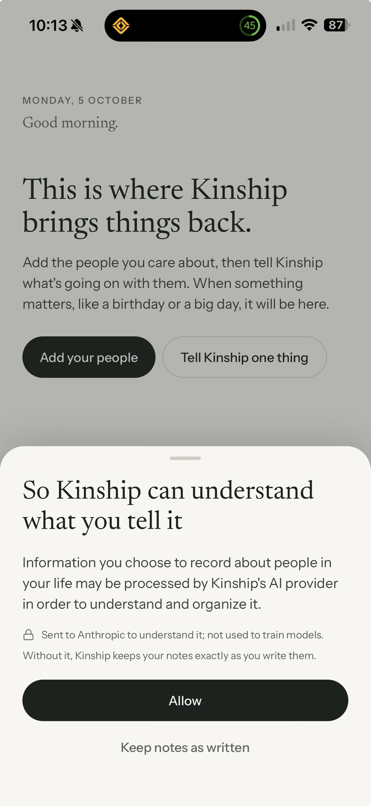 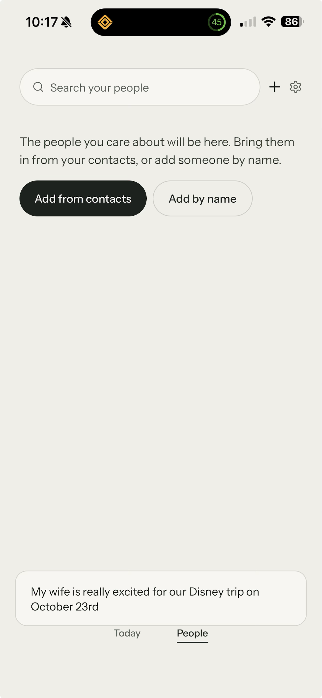

**What I found**
1. **The setup flow exists but was skipped.** It runs consent → pick your people → "Already worth knowing" → first Tell. One account skipped it legitimately, because it had earlier data. The other looked new but went straight to Today, with consent asked as a sheet over Today. That's a bug in when setup runs.
2. **Beyond setup, nothing explains the main screens.** Nothing says what Today is for, what the Tell field does, or what People holds.
3. **Nothing asks who you are.** That's also why Kinship calls you "the writer" (F6).

**Options**
- **(a)** Fix the setup gate only. Every new account then gets the four-step setup.
- **(b)** (a), plus a one-time tour after setup: three short, skippable cards pointing at Today, the Tell field and People. Shown once per account, whether or not you saw "See how it works".
- **(c)** (b), plus a "you" step at the start of setup: your first name, and optionally who you most want to show up for.

**Recommendation: (c), scoped tightly.**
- **Name:** ask for your first name. Kinship then says "your brother" in what it writes, and uses your name where a name is needed.
- **Who matters:** "Who do you want to show up for?" already exists as the contacts step, so this would only reword it as part of "you".
- **Personality questions:** I'd hold back on "what kind of person you are" for now. It adds a profile of the user that the approved design doesn't have, and it delays the first useful moment. A self profile needs your yes and a recorded decision in `approved-design-coverage.md`.

### F23: a new account sees the "mature" empty Today (my observation)

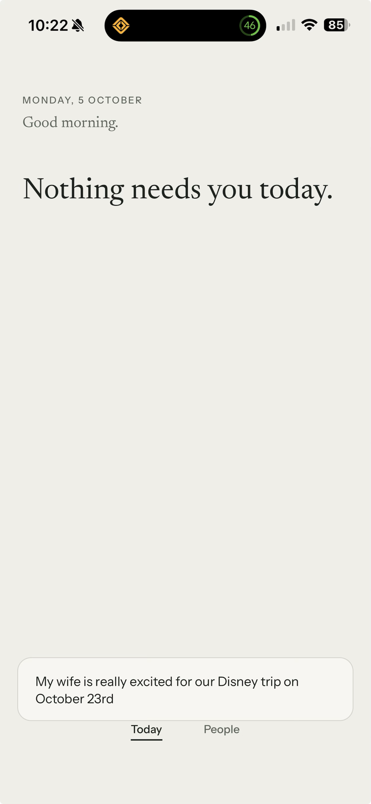

**What I found.** With one person added and nothing kept, Today has switched from the first-use guidance to the bare "Nothing needs you today." The contract says a new account must never land on an empty Today.

**Recommendation (bug).** Keep the first-use guidance until at least one note has been kept and understood, and extend the first-run test to cover "one person, no notes".

---

## 4. High: what Kinship remembers

### F4 · F6: facts on the wrong person, and "the writer"

> "I told a fact about Ben, where I said that he wants to play games with myself and my brother John. However, the first fact that's listed is that John is the writer's brother despite being on Ben's page."
> "I don't know if I like being addressed as 'the writer.' It's too impersonal. It should be tied to your name when you register for the app."

 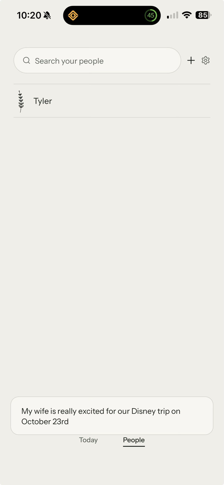

**What I found**
- **"The writer"** is the internal word the understanding step uses for you. It should never reach the screen. It shows on Ben's page, in "What Kinship knows" and in People's preview line.
- **"John is the writer's brother"** is a fact about John, but it was filed on Ben's page, and as the top "Lately" line.
- Ben being your brother wasn't captured at all.

**Options for naming you**
- **(a)** "you / your": "John is your brother", "with you and John".
- **(b)** Your first name: "with [your name] and John".

**Recommendation: (a) for what you read, (b) only where a third person speaks.** People don't talk about themselves in the third person, so "your brother" reads naturally.

**Fixes**
1. Change the understanding step's output so it says "you/your", never "the writer". Add a check that rejects any statement containing "the writer".
2. File relationship facts on the person they're about (John), and on both people when it's mutual.
3. Don't promote a fact about someone else to the top of a person's page.
4. When a note says "my brother John", offer to add John as a person, rather than leaving a stray fact on Ben.

### F5: facts can't be edited, only forgotten

> "There is no way to edit a fact that Kinship logs… I'd like to note that John and Ben are the writer's brothers, but I can only delete it."

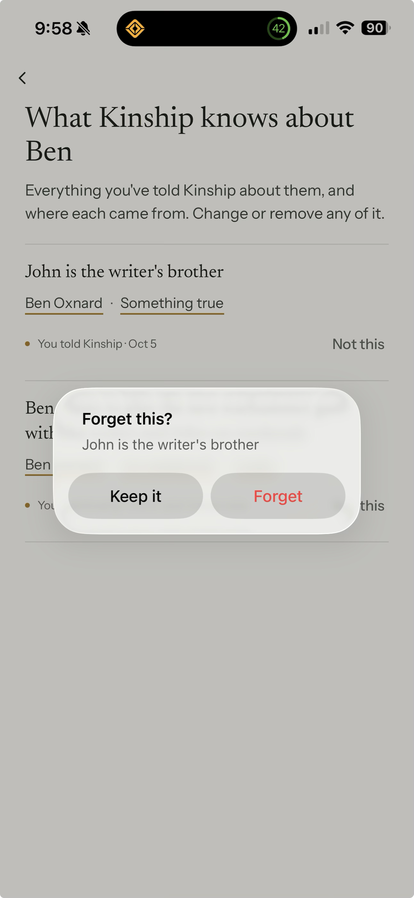

**What I found**
- Each line offers its person, its kind ("Something true") and "Not this". Nothing invites you to change the words.
- The Forget dialog's "Keep it" uses the same words as the button that saves a Tell, with a different meaning.

**Recommendation (no decision needed)**
- Make the statement itself tappable, and add a visible "Edit" action that opens the words for editing. Corrections are already supported underneath.
- Rename the dialog's buttons to "Cancel" / "Forget".

---

## 5. High: the unsent note that follows you

### F19 · F21 · F22

> "When I go to add my contacts, the original message I noted to Kinship is still sitting there, unsent. If I move onto another page, it shouldn't persist like that."
> "When I manually added my friend Tyler, the original unsent message for my wife is still persisting."
> "Same unsent note continues to persist even on the home page."

  

**What I found.** Today and People share the Tell field, so its draft lasts the whole session. With no send button (section 1), it can't leave either.

**Options**
- **(a)** Leaving the field (another tab, opening a person, adding someone) collapses it back to the small pill and keeps the draft quietly. Reopening shows "Draft" with the text.
- **(b)** Leaving clears it, with a brief "Draft discarded · Undo".
- **(c)** The draft stays only on the screen where it was typed.

**Recommendation: (a).** It does what you asked (the note stops sitting on every screen) without ever silently throwing away what someone wrote.

**Also to test once sending works.** This note is about your wife, who isn't in People. Kinship should offer to add her, not drop the note or guess.

---

## 6. Medium: the welcome screen

### F9 · F11: wall of text; would like a carousel or animation

> "It's just a wall of text that's not even organized neatly… Would be better if the login screen had some kind of rotating carousel or even a fun animated design to help orient those signing in?"

**What I found**
- Headline, subline, and three ruled lines all in the same body text, so nothing leads.
- "See how it works" sits left of the text margin, and is easy to miss.

**Options**
- **(a)** A calm three-panel carousel that you can swipe and that advances slowly on its own: Tell → Remember → Bring back. Each panel shows one real-looking example, taken from "See how it works". It replaces the three lines, with sign-in fixed below. Reduce Motion turns it into a plain swipe.
- **(b)** One quiet illustration: the sprig grows a leaf as each line fades in, once, about 1.5 s in total.
- **(c)** Keep it static, but tidy it: shorter headline, the three lines as numbered steps with small icons, and a proper "See how it works" button.

**Recommendation: (a).** It answers the orientation problem on the welcome screen without needing anyone to tap "See how it works", and it reuses content we already have. It does mean relaxing the approved design's "no decorative motion" rule for this one screen. Motion that explains something isn't decoration, but it's your call, and it gets recorded as a decision.

---

## 7. Medium: "See how it works"

### F12: show goals, not just facts

> "There should be some other details in the example here around the 4hr goal. If you want to show up for someone, don't you want to acknowledge their goals and not just facts about themselves?"

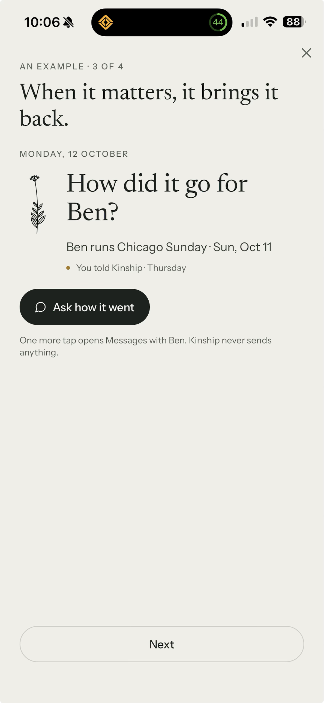

**What I found.** The example note says Ben "hopes to break four hours", and step 2 shows that goal as remembered. Step 3, the moment, drops it.

**Options**
- **(a)** Example only: show "Hoping to break four hours" under the step 3 moment.
- **(b)** Product: make goals and hopes a first-class kind of memory, shown with the event they belong to, on Today and on a person's page.

**Recommendation: do (a) now.** For (b), yes in principle; I think it's what Kinship is for. It touches how notes are understood and how Today chooses what to show, so it's a separate piece of work that needs your go-ahead.

### F13 · F14: an interactive "Yes", and "Anything worth remembering?" as its own step

> "There should be some sort of animated demo showing what happens when you select 'yes'. Also the 'anything worth remembering about Ben' feels like it should have its own screen as a part 5… It also is unclear what this is for from an end user perspective."

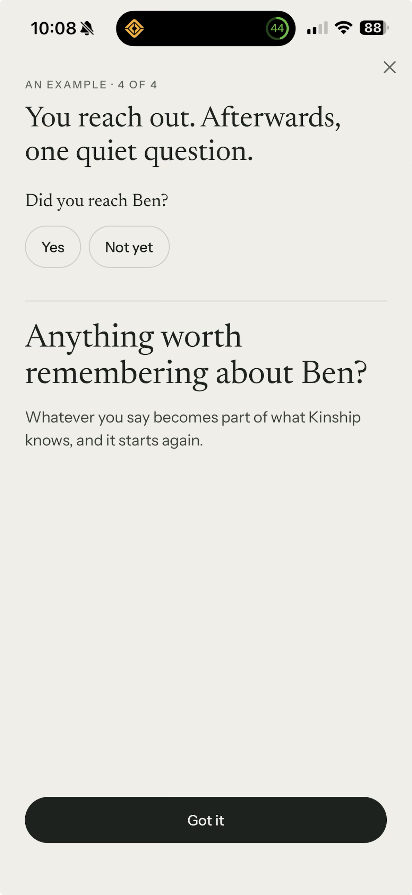

**What I found**
- Step 4 is a still picture. "Yes" and "Not yet" look tappable but do nothing.
- "Whatever you say becomes part of what Kinship knows, and it starts again" is abstract.

**Recommendation**
- **Step 4:** "Yes" is tappable, and plays itself after a moment if not tapped. The follow-up then arrives with the standard gentle rise.
- **New step 5, "It remembers more":** a sample reply is typed in ("Ran 3:52. So proud of him. Wants to do Berlin next."). Then Ben's page updates: the race moves into his history, and "Hoping to run Berlin" appears.

That closes the loop visibly: told, remembered, brought back, reached out, remembered more.

---

## 8. Medium: the consent screen

### F16: naming the AI provider up front

> "I'm not sure if I like this screen calling out the specific provider it's going to… the first thing being called out that it gets sent to an AI provider will lose the user's trust immediately."

**Constraint**
- The disclosure itself has to stay. Since November 2025, Apple's App Review Guideline 5.1.2(i) requires apps to say clearly when personal data goes to a third-party AI, and to ask permission first.
- The current sentence is the one you approved (decision D2).

**Options**
- **(a)** Reorder and reframe. Lead with the benefit and your choice ("Kinship can read your notes to pick out dates, plans and what matters to them"). Make "Keep notes as written" an equal second button. Put the provider line under a quieter "Who reads it?" line, still on the same screen and still before Allow.
- **(b)** Keep the wording, and soften only the layout.
- **(c)** Keep it as it is.

**Recommendation: (a).** It needs your sign-off on new D2 wording, and ideally a quick legal read.

**Separately (bug):** consent appeared as a sheet over Today instead of inside setup. That's part of F20's skipped setup.

---

## 9. Low

### F18: paired buttons look like a selected toggle

> "For some reason the 'Add your people' button is still selected despite me selecting the other button."

 

**What I found.** Nothing is selected. A filled main button next to an outlined one reads as a two-way toggle. The same pattern appears on People ("Add from contacts" / "Add by name").

**Recommendation.** Never put a filled and an outlined pill side by side. Use one main button, with the alternative as a text link underneath. Hide the pair while the Tell field is open.

### F8: Settings › Contacts does nothing

> "What is the point of the contacts portion in settings if there's nothing to adjust?"

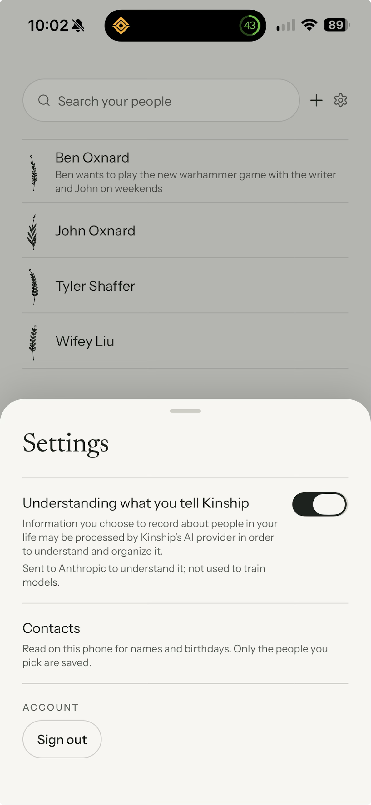

**Options**
- **(a)** Make it useful: show whether Kinship can see your contacts, add "Change in iOS Settings", and add "Add from contacts".
- **(b)** Remove it, and put its sentence in the privacy text.

**Recommendation: (a).** It's also the only way back for someone who refused Contacts during setup.

---

## Proposed order of work (once you say go)

1. **Section 1 and F10/F1.** Find and fix the shared cause of the missing and broken controls on a device build: send button, keyboard, Apple button, pencil. Unblocks everything else.
2. **F15.** Email sign-in bounce.
3. **F20 (a) and F23.** Setup runs for every new account; Today keeps its first-use guidance.
4. **F4/F6, F5.** "You/your" instead of "the writer"; facts filed on the right person; editable facts.
5. **F19 (a).** Draft behaviour.
6. **F18, F8.** Small layout fixes.
7. **Your decisions:**
   - F20 (b)/(c): tour and "you" step;
   - F11: welcome carousel;
   - F12 (b): goals;
   - F13/F14: example steps 4–5;
   - F16: consent wording.

**Decisions I need from you**

| # | Decision | My recommendation |
|---|---|---|
| 1 | F6: how Kinship refers to you | "you/your"; your first name only where needed |
| 2 | F19: unsent drafts | (a) collapse and keep as "Draft" |
| 3 | F20: onboarding scope | Fix setup; add a one-time tour; ask your first name. Hold personality questions |
| 4 | F11: welcome screen | (a) slow three-panel carousel |
| 5 | F12: goals as a product concept | Yes in principle; scope it separately |
| 6 | F13/F14: example steps | Interactive "Yes" plus a new step 5 |
| 7 | F16: consent wording | (a) benefit first, provider line second, legal check |
| 8 | F8: Settings › Contacts | (a) make it useful |
| 9 | F15: which account bounced at email sign-in | Tell me the account; I'll check its sign-in logs only |
