# Kinship: Gate 0 native findings

*The founder's iPhone testing of the **Gate 0 build** (PR #20, merge `b60b84c`), 7 Oct 2026, 2:23–4:19 pm PDT. Prepared for the Gate 0 session. **Logged only: nothing has been fixed.***

> **For the receiving session**
>
> - **Where everything is:**
>   - branch `claude/awesome-edison-3cuf6z`;
>   - full log `docs/product/gate0-native-findings.md`;
>   - screenshots `docs/product/screens/feedback4/g0-*.png`;
>   - commits `650dd6f` … `625384a`.
>   - **Pull before editing:** these were written by another session on the same branch.
> - **The ledger has already been changed on the branch:**
>   - **I12 → STILL OPEN** (re-seen);
>   - **I13 → STILL OPEN** (re-seen, on another path).
>   - The new items **J1–J7 are not yet in the ledger**; add them.
>   - Nothing was promoted to VERIFIED.
> - **Where the evidence comes from:**
>   - Reading the code at `c7475ac` and later.
>   - Two read-only queries of the **content-free** `ai_calls` log (no user id, no text, no names), for 7 Oct 22:30–23:14 UTC.
>   - No user data was read or changed.

## Summary

| # | ID | What the founder hit | Severity | Status | Cause |
|---|---|---|---|---|---|
| 1 | **I12** | After renaming her (Cutie Pie → Boo Boo → Loo Loo), every line still says "Wifey"; Today shows "Wifey got promoted" / "Congratulate Cutie" | P0 | **STILL OPEN** (re-seen) | Confirmed in code |
| 2 | **I13** | Answering "which Anthony / Sam?" with Someone else → Chris keeps "Anthony loves…" / "Sam loves…" | P0 | **STILL OPEN** (re-seen, new path) | Confirmed: code + call log |
| 3 | **J4** | "Wifey got a raise" → "Nothing to remember in that one. Your note is saved." The memory was dropped | P0 | New | Confirmed: call log + code |
| 4 | **J1** | "He loves Susan" on Pedro's page asks "Who is 'he'?", offers Susan as the default, and never offers Pedro | P0 | New | Hypotheses only |
| 5 | **J7** | Sam's page asks "Is this the Sam…?" about a line the founder already moved to Chris | P1 | New | Confirmed in code |
| 6 | **J2** | Correcting the person: no **Add Josh** for someone not in People ("No one by that name yet.") | P1 | New | Observed |
| 7 | **J6** | "and 1 more" on the Kept card can't be opened | P1 | New | Confirmed in code |
| 8 | **J5** | Swiping down doesn't close a line's detail sheet | P1 | New | Likely, from code |
| 9 | **J3** | Today → person page: highlight the line that was tapped | P2 (Phase 4, I1) | New | Request |

**Also noticed in the screenshots (questions, not reported by the founder):**
- Mochi's vet appointment is missing from Today.
- "Nothing needs you today." shows behind the review sheet.
- The instructional "Tap … to change it" copy is still there.

These are detailed at the end.

## Decisions the founder needs to make

1. **I12, renames made before the fix:** repair automatically (recommended), or rely on the one-time "rename to the old name and back" step, or add "Wifey" to her record directly (a data change: needs an explicit yes).
2. **J4 copy:** after a note with genuinely nothing in it, drop "Your note is saved", or keep it only with a **See the note** link.
3. **J6:** a hobby two people share: one shared line on both pages, or one line per person?
4. **Today and sensitivity:** should a pet's vet appointment count as sensitive health, which keeps it off Today?
5. **J3:** ship an interim "scroll to and briefly highlight the tapped line" now, or wait for I1 (Moment detail, Phase 4)?

**Facts only the founder can give:**
- **J7:** was **Yes** tapped on "Is this the Sam…?" (the line now shows on Sam Eden's page)?
- **J5:** does dragging down from the grabber itself work?

## Suggested order for the fix pass

1. **I12 properly.** Each line stores, as structured data, the words it used for its person. Display swaps exactly those words for the current name. Existing lines are filled in once. This removes the root of J4 and part of J7.
2. **I13 on every path**, including the server's answer path. This also removes J7's trigger.
3. **J4.** A memory is never dropped as "nothing"; an unresolved person becomes a question, with **Add &lt;name&gt;**.
4. **J1.** On a person's page, "he / she" with no other candidate means that person.
5. **J7.** Once the user has said who a line is about, name-matching link prompts never re-ask.
6. **J2:** Add a new person from the correction picker. **J6:** "and N more" is a control. **J5:** drag-to-close anywhere on a sheet.
7. **J3** with I1 (Phase 4), unless the founder wants the interim now.

---

## 1. I12: renaming still leaves "Wifey" everywhere (re-seen) · P0

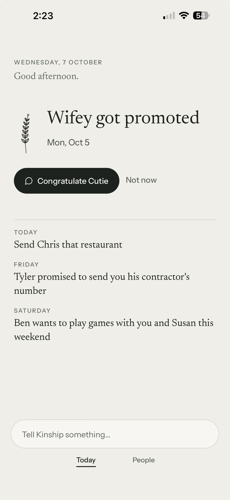 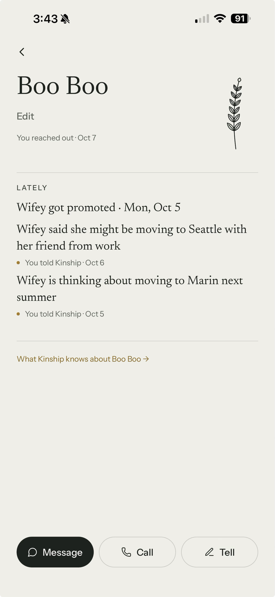 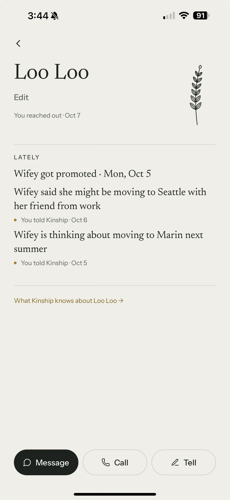

**What happened:**
- **2:23 pm.** Today reads **"Wifey got promoted"**, and the action reads **"Congratulate Cutie"** (cut to the first word).
- **3:43–3:44 pm.** The founder renamed **Cutie Pie → Boo Boo → Loo Loo**.
  - **Correct:** the titles ("Loo Loo", "What Kinship knows about Loo Loo").
  - **Wrong:** every line still says **"Wifey"** ("Wifey got promoted", "…moving to Seattle…", "…moving to Marin…").

**Cause (confirmed in the code):**
1. Her contact was "Wifey Liu"; the notes said "Wifey".
2. The **pre-fix** rename to Cutie Pie overwrote **both** her display name and her full name (`PeopleRepo.rename` before `8d43264`). After that, "Wifey" exists only inside her lines' words.
3. The fix (`8d43264`) learns earlier names **only at rename time, from the record** (`aliasesAfterRename`). The later renames recorded "Cutie Pie" and "Boo Boo", never "Wifey".
4. The checklist's workaround (rename to Wifey and back) wasn't done, and it isn't discoverable.

**This isn't only old data.** Any nickname used only in notes has the same gap. Example: contact "Elizabeth Chen", notes say "Liz"; renaming her to "Lizzie" never updates "Liz got promoted".

**Expected (CC-18 option A):**
- With **no manual step**, every surface (page, What Kinship knows, Today headline and action, review, return question, hand-off) shows **"Loo Loo got promoted"** / **"Congratulate Loo Loo"**.
- Source keeps "Wifey…".

**Recommended:**
- Store each line's subject-mention words structurally when it's understood.
- Fill them in once for existing lines (guarded: never a word that is another person's name, never a pronoun).
- Display substitutes that mention.

## 2. I13: choosing someone else in a "which person?" question keeps the old name (re-seen) · P0

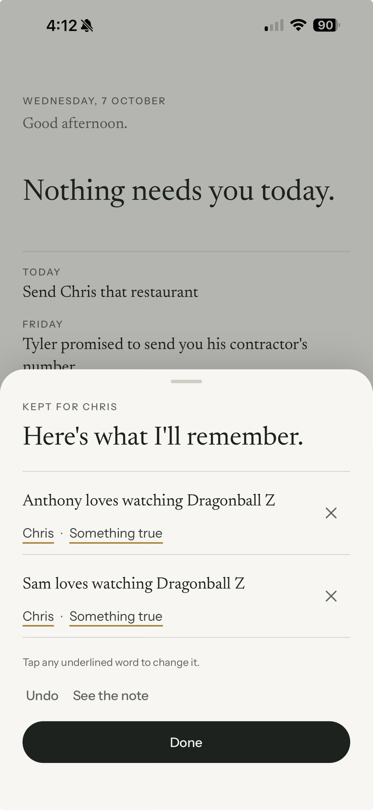

**What happened:**
1. Tell: "Anthony and Sam love watching Dragon Ball Z". People has two Anthonys (N3) and two Sams.
2. The call log shows the note **held** twice (4:08 and 4:09 pm: *clarify*, 2 held).
3. The founder answered **Someone else → Chris**.
4. Result: "KEPT FOR CHRIS", with **"Anthony loves watching Dragonball Z"** and **"Sam loves watching Dragonball Z"**, both on Chris.

**Cause (confirmed in the code):**
- The I13 fix (`d5f4586`) renames the subject only when a **saved** line is moved (`Understanding.correct` → `withSubjectMoved`).
- Answering a **held** question goes through the server (`resolve.ts`). There, `withSpokenName` (`voice.ts`) only replaces a leading **He / She / His / Her**, never a leading **name**.

**Expected:**
- On every path that sets who a line is about, the line names the chosen person ("Chris loves watching Dragon Ball Z"), with "was:" history and the note untouched.
- If the chosen person goes by the name already in the line (a Samantha who goes by Sam), the name stays.
- Two lines that end up identical on one person merge into one.

## 3. J4: "Wifey got a raise" dropped as "nothing to remember" · P0

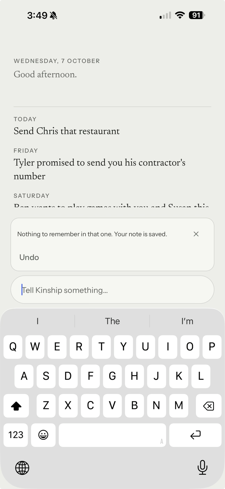 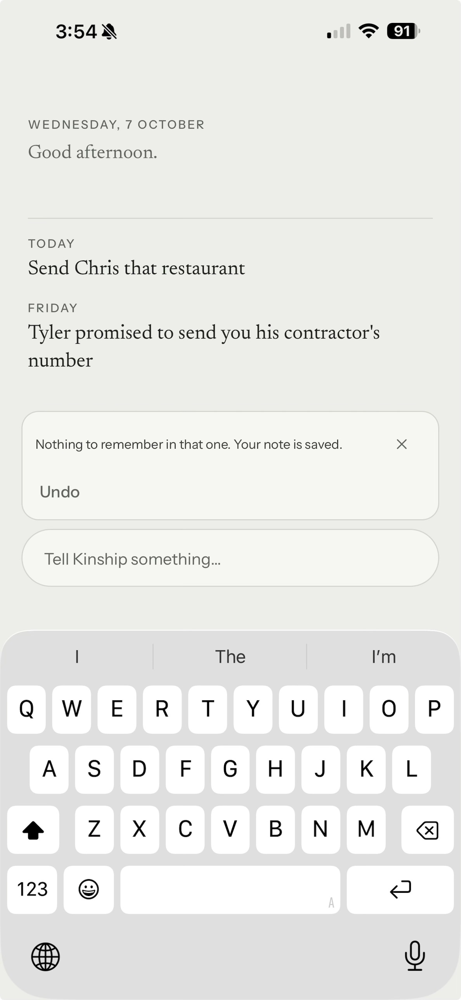

**What happened.** 3:49 and 3:54 pm: "Nothing to remember in that one. Your note is saved."

**The content-free call log:**
- 22:49:22 UTC (3:49 pm): result *nothing*, saved 0, held 0, **dropped 1**, reason **`invented_relation`**.
- 22:53 UTC: dropped the same way.

**Cause:**
1. "Wifey" is no longer a known name (the I12 gap).
2. So the model most likely read it as **"wife"**.
3. The made-up-relationship guard (`inventedRelations`, `pipeline.ts`) dropped the only memory.
4. With nothing left, the card says "Nothing to remember".

**Founder's additions:**
- Even if Wifey were genuinely new, there must at least be **Add Wifey**.
- **"Your note is saved" is wrong:** nothing the user can see was saved. The card offers only Undo, and the 2.0 app has no place to find a note that produced no memory (Source opens only from a memory's line).

**Expected:**
- A memory is **never** dropped as "nothing" because of a guard or an unknown person. Kinship keeps the words and asks **"Who is Wifey?"**: the people it could be, **Add Wifey**, and Don't keep this.
- A relation word the model invented is removed from the wording, not used as a reason to discard the memory.
- "Nothing to remember" is only for notes with genuinely nothing in them. Its "saved" wording is the founder's decision (see above).

## 4. J1: "He loves Susan" on Pedro's page doesn't offer Pedro · P0

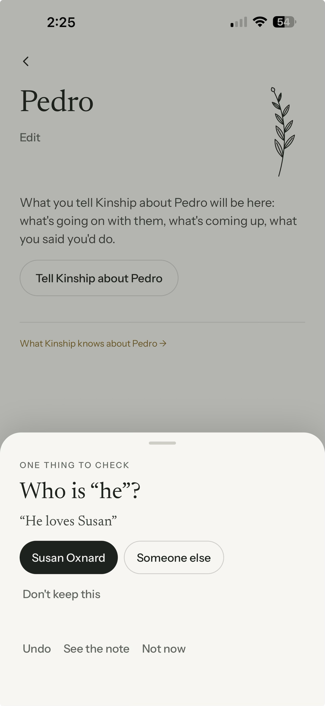

**What happened (2:25 pm):**
1. On **Pedro's** page (new, added via "Add Pedro", no phone number), the founder told "He loves Susan".
2. It asked **"Who is 'he'?"** and offered **Susan Oxnard** (filled, as the default) and Someone else.
3. **Pedro wasn't offered.**

**Expected:**
- Told from a person's page, with no other candidate, "he / she" means **that person**: no question; "Pedro loves Susan" is kept on Pedro.
- If a question is ever needed, the page's person is a choice.
- The sentence's **object** (Susan) is never offered for "he", let alone as the default.

**Hypotheses (not investigated):**
- The page context isn't sent or used as the default subject.
- Pedro wasn't a candidate yet (newly created, not yet synced).
- Choices come from names in the note without excluding the object.
- The phone number is very likely irrelevant.

## 5. J7: Sam's page asks "Is this the Sam…?" after the founder chose Chris · P1

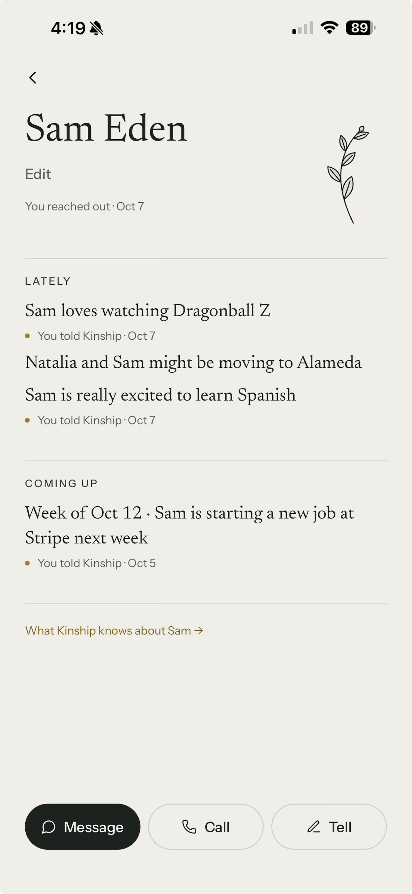

**What happened (4:19 pm).** Sam Eden's page asked whether this was the Sam who loves Dragon Ball Z, although the founder had already said that line is about Chris. In the screenshot the line now shows in **Sam Eden's Lately**, so it is linked to him (ask the founder whether Yes was tapped).

**Cause (confirmed in the code):**
- `src/features/person/links.ts` suggests linking any memory on someone else **whose words name this person's first name**, unless the name belongs to someone on the memory.
- The line still says "Sam" (the I13 gap), so **both** Sams are asked, and both Anthonys will be too.

**Expected:**
- With I13 fixed, nothing names a Sam.
- Independently: **once the user has said who a line is about** (answered, picked Someone else, or corrected), name-matching prompts never re-ask about it. The user's decision wins (contract §7.4).

## 6. J2: no "Add Josh" when correcting the person · P1

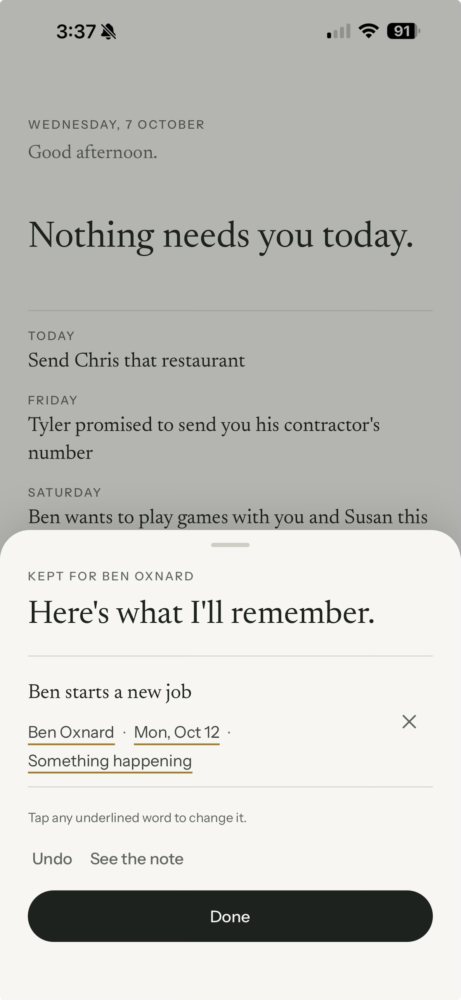 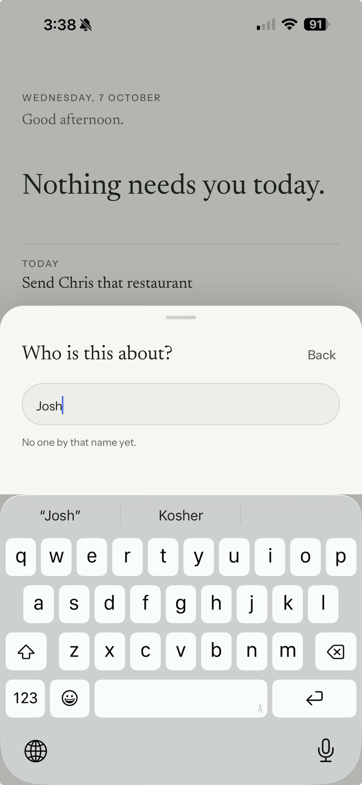

**What happened (3:37–3:38 pm):**
1. On "Ben starts a new job" (kept for Ben Oxnard), the founder tapped the person to change it to **Josh**, who isn't in People or Contacts.
2. "Who is this about?" → typing "Josh" → **"No one by that name yet."** Nothing else; the only way out is Back.

**Expected:**
- **Add Josh** when no one matches. One tap creates him (typed, no number needed) and moves the line.
- With I13, the line then reads "Josh starts a new job", with history.
- It's the user's explicit choice, as with **Add Pedro** (H21).

## 7. J6: "and 1 more" on the Kept card can't be opened · P1

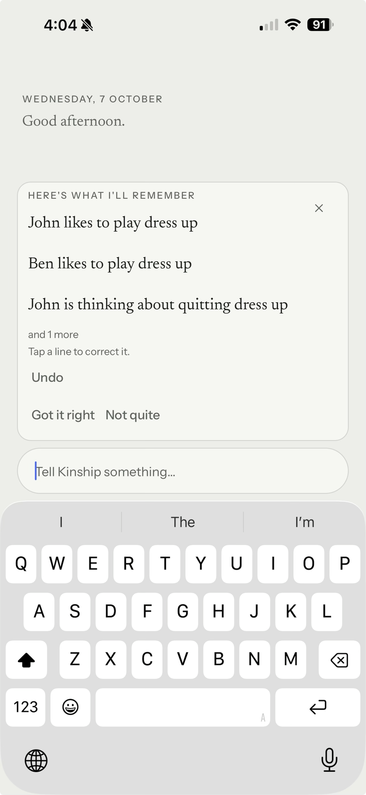

**What happened (4:04 pm).** Tell: "John and Ben like to play dress up but are thinking about quitting the hobby." The card shows three lines, then **"and 1 more"**, which can't be tapped to check that it's Ben's.

**Cause (confirmed in the code):**
- `KeptCard` (`src/features/tell/TellDock.tsx`) shows the first three lines; **"and N more" is plain text**.
- Tapping a shown line does open the full review, but nothing says so.

**Expected:** "and N more" is a real control that expands in place (like Today's Coming up, H27) or opens the full review. No kept line is unreachable from the card.

**Product question:** the note was kept as **four one-person lines** rather than **two shared lines** ("John and Ben like to play dress up", on both pages, the H5 shape). Which does the founder want for a shared hobby?

## 8. J5: swiping down doesn't close a line's detail sheet · P1

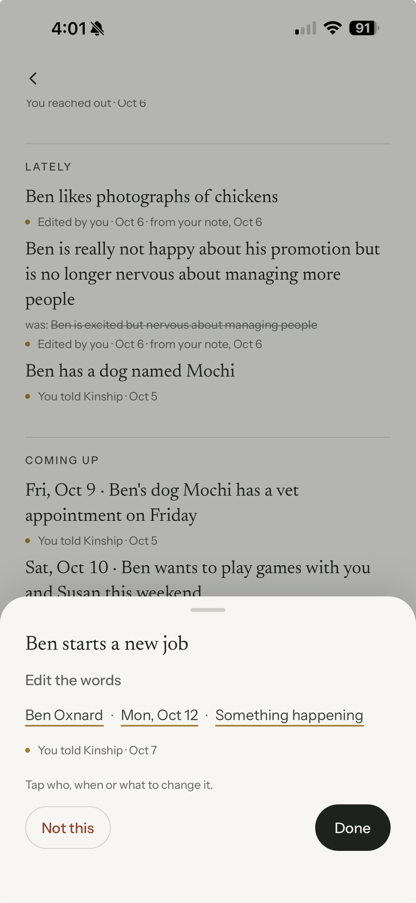

**What happened (4:01 pm).** On the "Ben starts a new job" sheet (opened from Ben's page), swiping down does nothing.

**Likely cause (from the code):**
- The shared `Sheet` (`src/ui/Sheet.tsx`) attaches the drag-to-close gesture **only to the thin strip around the grabber**, roughly the top 50 pt.
- Swipes starting on the content go to its scroll view.
- Every sheet uses this component, so the same likely applies everywhere.

**Expected:**
- A downward drag from anywhere closes a sheet whose content is at the top; scrolled content scrolls first.
- From a confirmation, closing returns to it (I9).

## 9. J3: highlight the tapped line when Today opens a person's page · P2 (Phase 4)

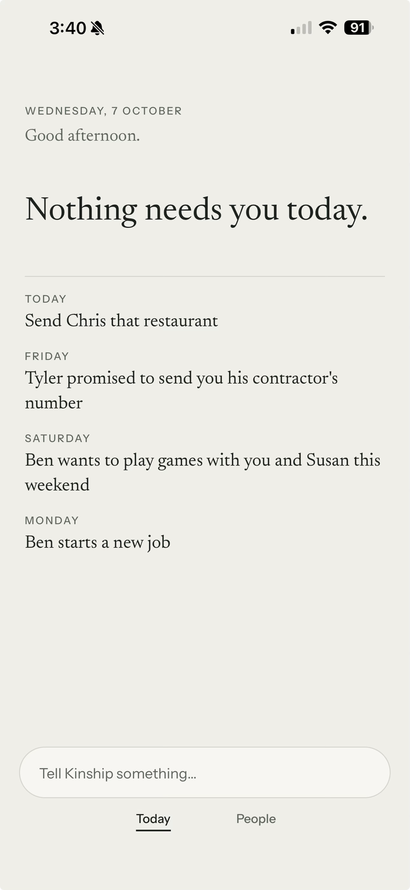 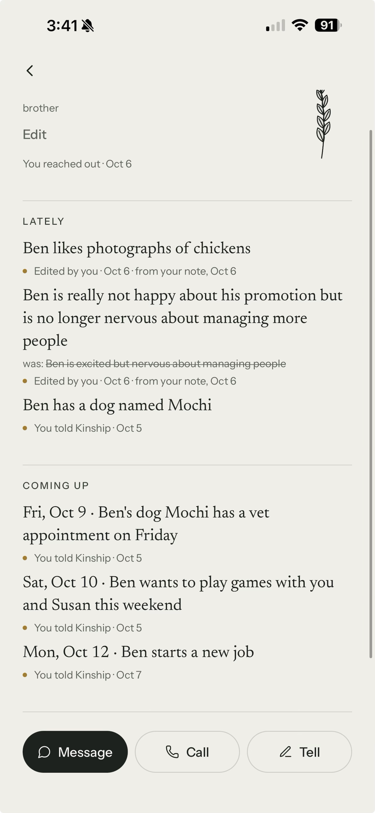

**What happened (3:40–3:41 pm).** Tapping Coming up "Monday · Ben starts a new job" opens Ben's long page with nothing emphasised; the line is at the bottom of Coming up.

**Fit:** this is the deep-link half of **I1** (CC-18: "View Ben" deep-links with brief, quiet emphasis).

**Interim option (founder's choice):** scroll to that line and briefly, quietly emphasise it, respecting Reduce Motion. Today's Coming up lines already carry the memory id.

## Also noticed (questions for triage, not reported by the founder)

- **Mochi's vet appointment (Fri, Oct 9) is on Ben's Coming up but not on Today's.**
  - **Likely cause:** Today excludes anything with `sensitivity` ≠ "none" (`todayModel.ts` `live()`); the person page doesn't. The vet visit was probably classed as health.
  - **Question:** should a pet's vet appointment count as sensitive?
- **"Nothing needs you today." shows behind the "Here's what I'll remember" sheet** (3:37 pm screenshot). G27(a) / H19 removed it behind the inline Kept card. This is a possible re-sighting; its status is not changed.
- **Instructional copy is still present:** "Tap any underlined word to change it." and "Tap a line to correct it." I4 (Phase 4) replaces it with **Correct this**.

## Native re-checks after the fixes

- **I12:** with no manual step, Loo Loo's page, What Kinship knows, Today ("Loo Loo got promoted", "Congratulate Loo Loo") and the review all use **Loo Loo**; Source shows "Wifey…".
- **J4:** "Wifey got a raise" is filed on Loo Loo ("Loo Loo got a raise"). An unknown name ("Zed got a raise") asks **Who is Zed?** with **Add Zed**; it is never "Nothing to remember".
- **I13:** "Anthony and Sam love watching Dragon Ball Z" → Someone else → Chris gives **one** line, "Chris loves watching Dragon Ball Z", with "was:" history.
- **J7:** after that, neither Sam's nor either Anthony's page asks about it.
- **J1:** "He loves Susan" told on Pedro's page is kept as "Pedro loves Susan", with no question.
- **J2:** correcting to a new name offers **Add Josh**, and the line reads "Josh starts a new job".
- **J6:** "and 1 more" opens the hidden line.
- **J5:** a swipe down from the middle of any sheet closes it.
